## 1. RAGFlow RAG系统总体架构

### 1.1 系统概述

RAGFlow的RAG系统是一个企业级的检索增强生成系统，采用分层架构和微服务设计，实现了从查询处理到答案生成的完整流程。系统基于Python开发，使用多种开源和商业LLM模型，支持多语言、多模态的文档处理和智能问答。

### 1.2 架构风格

RAGFlow RAG系统采用了以下架构风格：
- **分层架构**：清晰的层次划分
- **管道-过滤器架构**：数据处理流水线
- **插件架构**：支持多种模型和存储后端
- **事件驱动架构**：异步任务处理

### 1.3 系统边界与接口

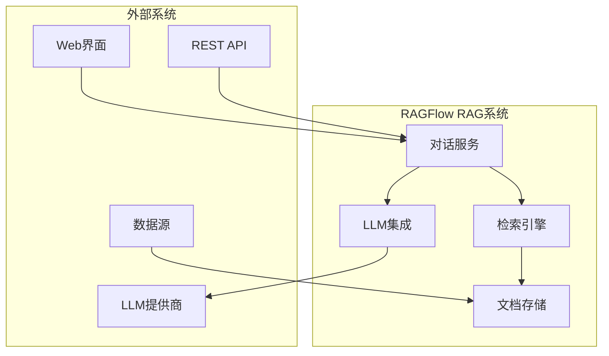

## 2. 核心组件架构分析

### 2.1 对话服务层（DialogService）

**位置**：`api/db/services/dialog_service.py`

**职责**：
- 协调整个RAG流程
- 管理对话状态和上下文
- 处理用户请求和响应

**架构特点**：
- 采用门面模式
- 实现了服务层架构模式
- 支持流式响应和实时交互

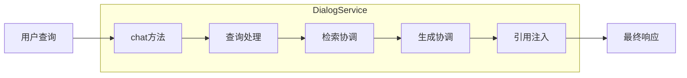

### 2.2 检索引擎（Dealer）

**位置**：`rag/nlp/search.py`

**职责**：
- 实现混合搜索算法
- 管理检索策略和参数
- 提供重排序功能

**架构特点**：
- 策略模式：支持多种检索策略
- 组合模式：组合多种检索结果
- 模板方法模式：定义检索流程骨架

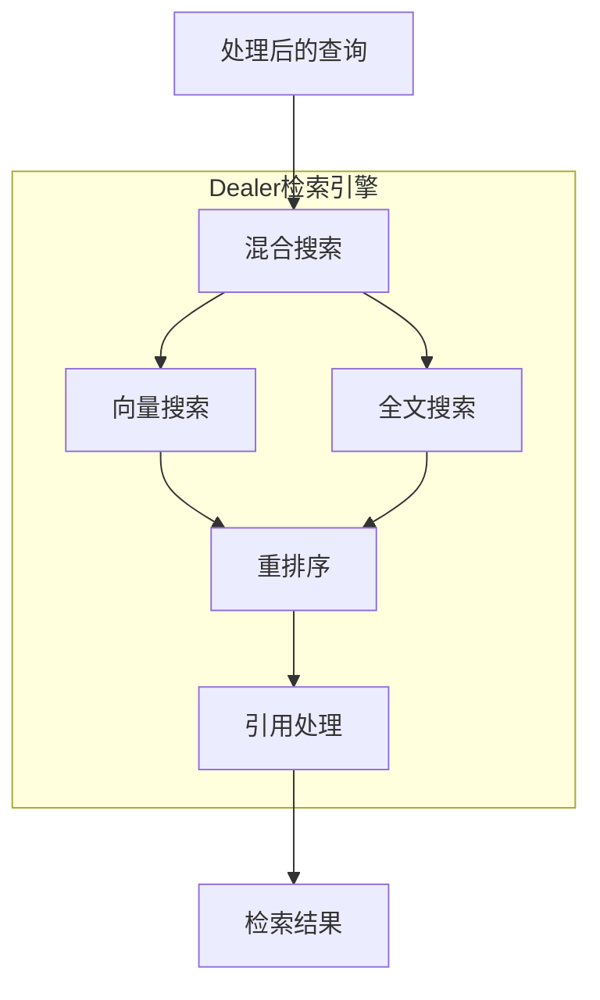

### 2.3 查询处理组件（FulltextQueryer）

**位置**：`rag/nlp/query.py`

**职责**：
- 文本规范化和清理
- 多语言查询处理
- 关键词提取和扩展

**架构特点**：
- 责任链模式：多阶段查询处理
- 策略模式：不同语言的处理策略
- 装饰器模式：查询增强功能

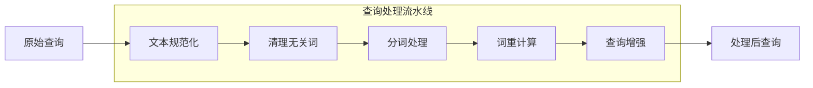

### 2.4 LLM集成层

**位置**：`rag/llm/`

**职责**：
- 封装多种LLM提供商
- 统一模型调用接口
- 管理模型配置和负载

**架构特点**：
- 适配器模式：统一不同LLM接口
- 工厂模式：动态创建模型实例
- 代理模式：添加缓存和监控功能

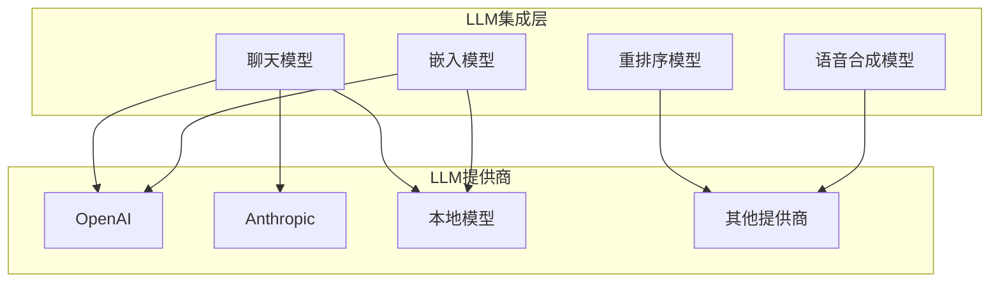

## 3. 数据流架构分析

### 3.1 端到端RAG流程

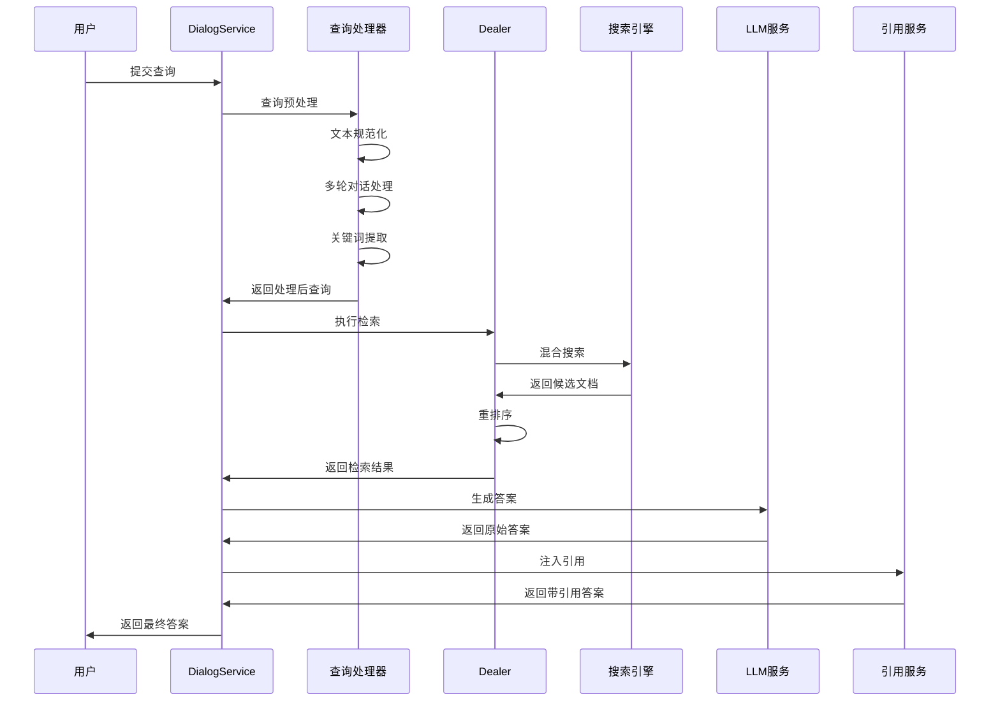

### 3.2 混合搜索架构

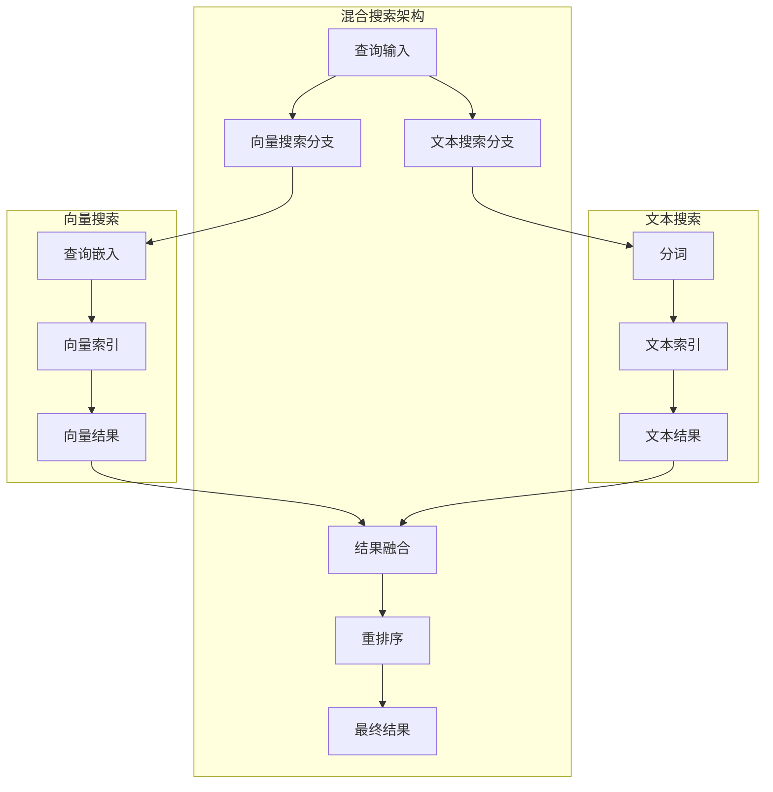

## 4. 配置与扩展性架构

### 4.1 配置管理架构

RAGFlow采用分层配置管理：

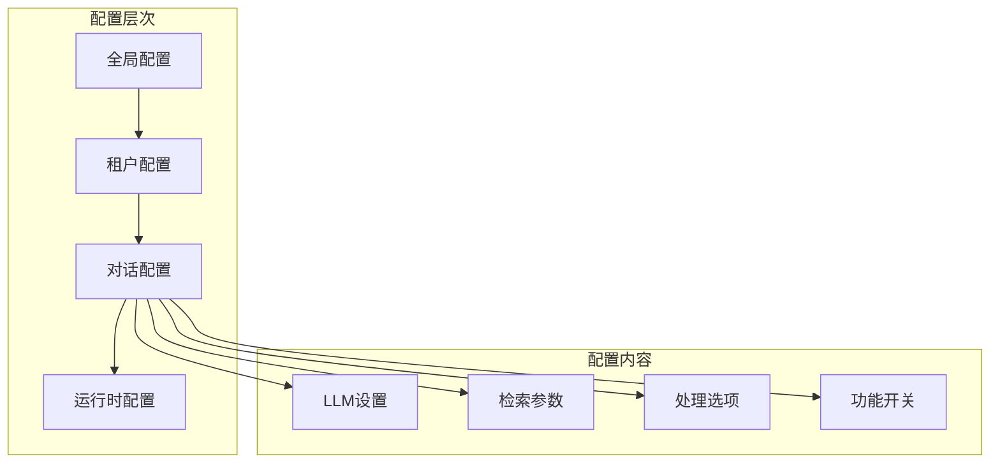

### 4.2 插件架构

RAGFlow支持多种插件扩展：

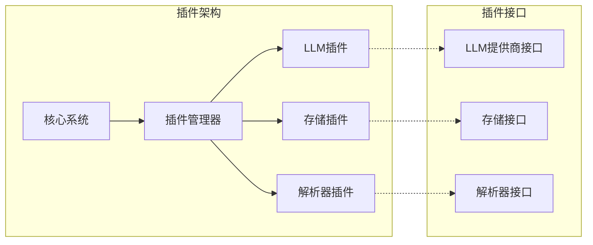

## 5. 性能与可扩展性设计

### 5.1 缓存架构

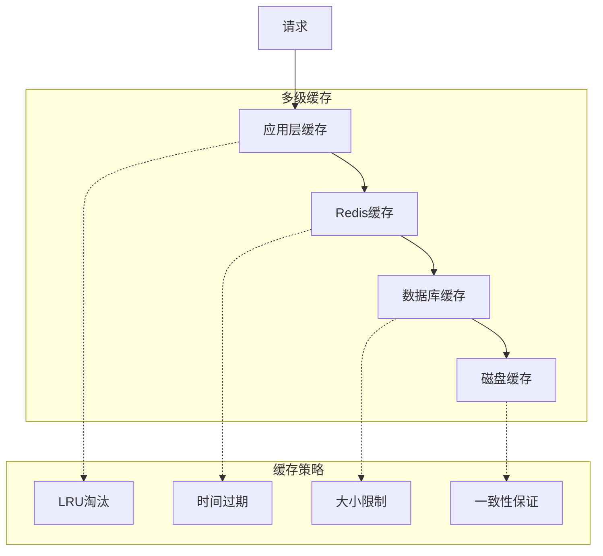

### 5.2 并发处理架构

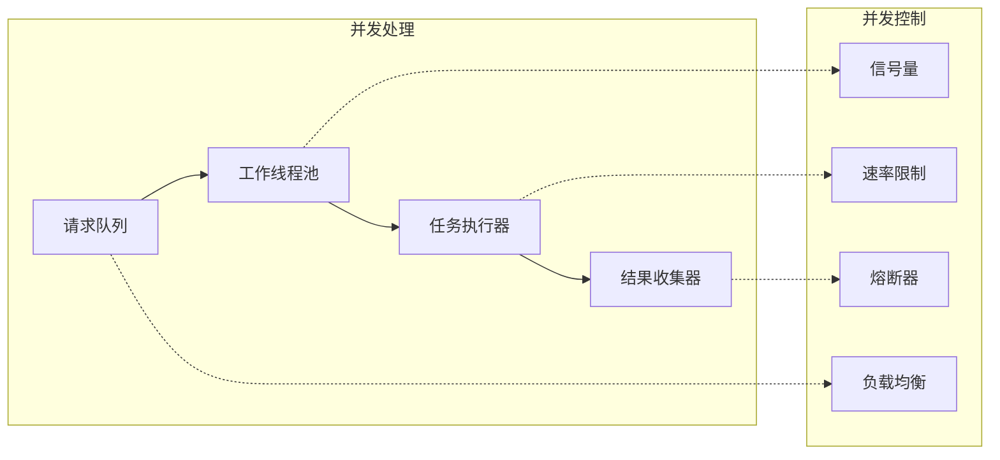

## 6. 安全架构

### 6.1 安全层次

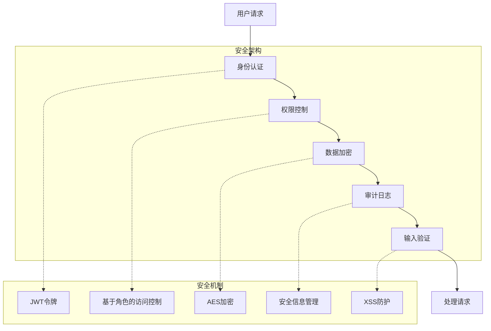

