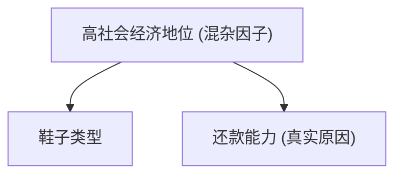

### 机器学习中的静态世界假说

在机器学习的理论模型中，我们通常依赖一个核心的、却往往被忽略的假设：独立同分布（Independent and Identically Distributed, IID）。我们假定训练数据和未来将要遇到的测试数据，都是从同一个潜在的、静态不变的概率分布中独立抽取的。这个假设为我们提供了一个稳固的理论基石，使得经验风险最小化（Empirical Risk Minimization）等策略得以成立。

然而，当我们把模型从实验室推向真实世界时，这个美好的静态世界假说便会迅速瓦解。现实世界是动态的、非平稳的。用户的偏好会演变，产品的市场环境会改变，甚至模型自身的部署都会成为改变数据分布的催化剂。训练分布与测试分布之间的差异，我们称之为**分布偏移（Distribution Shift）**。忽视分布偏移，是导致机器学习系统在生产环境中表现不佳甚至灾难性失败的首要原因。

接下来，我们需要首先建立一个清晰的概念分类法，随后深入探讨其产生的根本原因，最后转向讨论检测、纠正及从设计上缓解此问题的策略。

### 分布偏移的分类法

为了有效地应对分布偏移，我们必须首先学会识别它。不同的偏移类型有着不同的底层假设和应对策略。一个机器学习问题的数据生成过程可以被建模为联合分布 $P(\mathbf{x}, y)$，它可以被分解为 $P(y|\mathbf{x})P(\mathbf{x})$ 或 $P(\mathbf{x}|y)P(y)$。分布偏移正是源于训练时所见的源分布 $P_S$ 与测试时所见的目标分布 $P_T$ 在这些组成部分上的差异。

#### 协变量偏移

协变量偏移（Covariate Shift）是最常见的一种分布偏移。它假设输入特征的边缘分布发生了变化，但特征与标签之间的条件关系保持不变。

*   **形式化定义**: $P_S(\mathbf{x}) \neq P_T(\mathbf{x})$, 但是 $P_S(y|\mathbf{x}) = P_T(y|\mathbf{x})$。
*   **内在含义**: 产生标签的“规则”或“机制”是稳定的，但是我们遇到的“问题实例”的分布却变了。例如，一个根据真实照片训练的猫狗分类器，其识别猫狗相貌的内在逻辑是正确的。但如果将其部署于一个只处理卡通动漫图片的环境，模型性能可能会急剧下降。尽管“猫的卡通形象”和“狗的卡通形象”背后的标签逻辑未变，但输入的像素分布已然天差地别。医学诊断中，用年轻健康学生作为对照组，去检测主要影响老年人的疾病，是协变量偏移的另一个极端例子。

#### 标签偏移

标签偏移（Label Shift）描述了与协变量偏移相反的情况。它假设标签的边缘分布发生了变化，但给定标签下，特征的条件分布保持稳定。

*   **形式化定义**: $P_S(y) \neq P_T(y)$, 但是 $P_S(\mathbf{x}|y) = P_T(\mathbf{x}|y)$。
*   **内在含义**: “问题实例”的样貌生成机制是稳定的，但是不同类别实例出现的频率发生了变化。例如，一个根据症状诊断疾病的模型，其核心知识“某疾病会引发何种症状” ($P(\mathbf{x}|y)$) 是稳定的医学知识。但由于季节变化，流感的流行率 ($P(y=\text{流感})$) 在冬季会远高于夏季。如果模型在训练时未考虑这种标签分布的变化，其整体性能可能会受影响。

#### 概念偏移

概念偏移（Concept Shift）是最具挑战性的一种偏移，因为它直接动摇了模型学习的根本。它指的是特征与标签之间的关系本身发生了变化。

*   **形式化定义**: $P_S(y|\mathbf{x}) \neq P_T(y|\mathbf{x})$。
*   **内在含义**: 预测的“规则”本身已经改变。一个用于预测时尚潮流的模型，其对“时髦”的定义 ($P(y=\text{时髦}|\mathbf{x})$) 必然会随时间演变。同样，一个垃圾邮件过滤器面对的邮件模式也在不断进化，因为邮件制造者会有意地改变策略以规避检测。在这种情况下，模型过去学到的知识可能不再适用，甚至会产生误导。

### 问题是怎么来的？

理解了分布偏移的类型，一个更深层的问题随之而来：为何模型对这些偏移如此脆弱？根本原因在于，大多数标准的机器学习模型，尤其是深度神经网络，极其擅长学习**相关性（Correlation）**，而非底层的**因果性（Causation）**。

==相关性是脆弱的，它可能只是特定数据集、特定时间窗口下的统计巧合。而因果关系则描述了稳定、可迁移的物理或逻辑规律。当分布发生偏移时，脆弱的相关性往往首先被破坏。==

以一个信用风险模型为例，如果模型发现“申请人穿昂贵的鞋子”与“低违约风险”高度相关，它可能会学到这个捷径。然而，这并非因果关系。一个潜在的、未被观测的**混杂因子（Confounder）**，如“高社会经济地位”，才是同时导致“穿昂贵的鞋子”和“低违约风险”的共同原因。

一个仅学习到 $B \to C$ 伪相关的模型，在其被部署后会立刻失效。因为一旦申请人发现这个规则，他们可以通过简单地改变鞋子来“欺骗”模型，而其真实的还款能力并未改变。这种由模型部署本身引发的分布变化，是一种被称为**“策略性响应”**的特殊情况。

只有当模型尝试去逼近真实的因果关系 $A \to C$ 时，它才有可能在面对分布变化时保持鲁棒。因此，追求因果推断成为解决分布偏移问题的根本性思路之一。

### 应对策略 系统性的缓解方案

应对分布偏移需要一套组合策略，它涵盖了从数据到模型，再到部署后监控的整个生命周期。

#### 探测与监控

在纠正偏移之前，必须先能准确地探测到它。这要求建立一套超越简单精度监控的 MLOps 体系。关键的监控指标包括：
*   **输入分布监控**: 持续追踪线上数据的特征统计量（如均值、方差、缺失值比例），并与训练时的基线进行统计检验（如KS检验）。显著的偏离是协变量偏移的明确信号。
*   **输出分布监控**: 监控模型预测值的分布。预测类别的比例发生剧烈变化，往往暗示着标签偏移的发生。
*   **模型性能监控**: 除了整体精度，还应监控在关键数据切片（Slices）上的性能。一个在特定用户群体上性能突然下降的模型，可能正在经历局部化的分布偏移。

#### 纠正方法

当探测到偏移后，可以采用相应的纠正算法。其核心思想是**重要性加权（Importance Weighting）**，即通过为训练样本分配权重，来修正经验风险的计算，使其能更好地逼近真实的目标风险。

*   **协变量偏移纠正**: 其权重 $\beta_i = P_T(\mathbf{x}_i)/P_S(\mathbf{x}_i)$ 的直觉是，给予那些在训练集中“欠采样”，但在测试集中更常见的样本更高的权重。这个比率通常通过训练一个分类器来区分源域和目标域的样本来估计。
*   **标签偏移纠正**: 其权重 $\beta_i = P_T(y_i)/P_S(y_i)$ 的计算则依赖于对目标域标签分布 $P_T(y)$ 的估计。一种有效的方法是利用一个已有的、性能尚可的分类器，通过其在源域上的混淆矩阵和在目标域上的预测均值，来反解出目标域的真实标签分布。

#### 设计鲁棒的模型与系统

除了被动地纠正，更主动的策略是在系统设计之初就考虑分布偏移问题。
*   **数据中心的AI实践**: 与其过度依赖算法，不如主动优化数据。通过**主动学习（Active Learning）** 优先标注模型最不确定的样本，或者通过**对抗性数据增强**生成模型难以处理的边缘案例，可以显著提升模型对未见分布的适应能力。
*   **因果表征学习**: 探索能够学习到数据背后不变因果机制的表征，而非表面相关性的模型结构与优化目标。
*   **持续学习的架构**: 认识到任何模型都非一劳永逸。建立自动化的模型再训练与部署流水线（MLOps），使模型能够与时俱进，持续地从新数据中学习，是应对非平稳环境的唯一长期有效的策略。