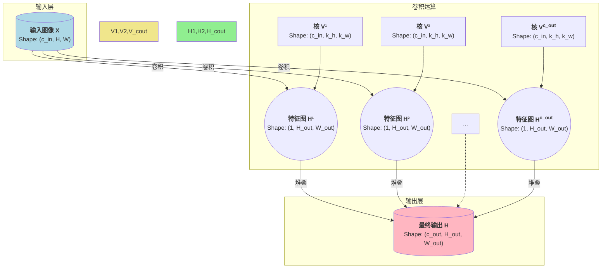

### 卷积的数学定义与互相关

首先，我们需要厘清一个在数学和深度学习领域中经常混淆的概念：**卷积（Convolution）**与**互相关（Cross-Correlation）**。

#### 1. 严格的数学定义 (连续与离散)

在数学分析中，两个函数 $f$ 和 $g$ 的卷积通常定义为一个积分：

$$
(f * g)(t) = \int_{-\infty}^{\infty} f(\tau) g(t - \tau) d\tau
$$

这里，$g(t - \tau)$ 表示将 $g(\tau)$ 关于 $\tau = 0$ 对称翻转，然后平移 t 个单位。
而对于离散的二维信号（如图像），其定义为一个双重求和：

$$
(\mathbf{V} * \mathbf{X})_{i,j} = \sum_{a} \sum_{b} \mathbf{V}_{a,b} \mathbf{X}_{i-a, j-b}
$$

请注意这里的索引：$\mathbf{X}_{i-a, j-b}$。这暗示着在进行加权求和之前，需要将卷积核 $\mathbf{V}$ 进行**翻转（flip）**。

假设我们有一个二维信号 $\mathbf{X}$ 和一个卷积核 $\mathbf{V}$。为了计算卷积 $\mathbf{V} * \mathbf{X}$，我们需要：将卷积核 $\mathbf{V}$ 关于其中心对称翻转。将翻转后的卷积核在信号 $\mathbf{X}$ 上滑动，每次滑动时计算卷积核与信号对应位置的点积。

具体来说，假设卷积核 $\mathbf{V}$ 的大小为 $m \times n$，其元素为 $\mathbf{V}_{a,b}$（其中 a 和 b 是索引）。在计算 $(\mathbf{V} * \mathbf{X})_{i,j}$ 时，我们需要：将卷积核 $\mathbf{V}$ 翻转，使得原来的 $\mathbf{V}_{a,b}$ 变为 $\mathbf{V}_{-a,-b}$。将翻转后的卷积核与信号 $\mathbf{X}$ 在位置 $(i,j)$ 处对齐，计算点积。

#### 2. 深度学习中的“卷积” (实际是互相关)

而在深度学习的实践中，我们通常实现的运算是**互相关（Cross-Correlation）**。其二维离散形式为：

$$
(\mathbf{V} \star \mathbf{X})_{i,j} = \sum_{a} \sum_{b} \mathbf{V}_{a,b} \mathbf{X}_{i+a, j+b}
$$

这个公式与我们上一轮在[初识卷积神经网络-从全连接到卷积](Blog/Deeplearning/初识卷积神经网络-从全连接到卷积.md)推导出的最终形式完全一致。它省去了翻转核的步骤，实现起来更直接，也更符合“模板匹配”的直觉。

**为什么深度学习称其为卷积？**
因为卷积核 $\mathbf{V}$ 的权重本身就是通过学习得到的。一个神经网络可以学习到一个翻转的核，也可以学习到一个不翻转的核，两者在表达能力上是等价的。由于省去翻转操作可以简化代码并略微提升效率，深度学习框架（如PyTorch, TensorFlow）中的“卷积层”实际上执行的是互相关运算。从今以后，当我们谈论深度学习中的卷积时，默认指的就是这种**不带翻转的互相关操作**。

### 深入三维 计算机视觉中的真实卷积

现实世界中的图像通常不是二维的灰度图，而是三维的彩色图像。我们需要将卷积的概念扩展到处理三维张量。

#### 1. 彩色图像的三维表示

一张彩色图像通常由三个**通道（Channels）** 组成：红色（Red）、绿色（Green）和蓝色（Blue）。因此，一张`高度 x 宽度`的彩色图像，在数学上被表示为一个三维张量，其形状为：
$$
\text{形状} = (\text{通道数}, \text{高度}, \text{宽度})
$$
例如，一张 $224 \times 224$ 的彩色图像，其张量形状为 $(3, 224, 224)$。这个“通道”维度，就是我们所说的第三个维度。

**一个重要的概念转变**：在二维灰度图中，每个位置 $(i,j)$ 只有一个像素值。而在三维彩色图中，每个位置 $(i,j)$ 对应一个包含3个值的**像素向量**，分别代表R, G, B的强度。

#### 2. 卷积核的相应扩展

为了处理三维的输入图像，我们的卷积核也必须相应地扩展为三维。如果输入图像有 $c_{in}$ 个通道，那么卷积核的形状将是：

$$
\text{核形状} = (c_{in}, k_h, k_w)
$$

其中 $k_h$ 和 $k_w$ 是核的高度和宽度。

这个三维的卷积核，其**深度（通道数）必须与输入图像的深度（通道数）完全匹配**。我们可以把这个三维核想象成一个“立体”的模板。

#### 3. 三维卷积的运算过程

现在，让我们来描述一个三维卷积核如何在一个三维输入图像上进行运算，以产生一个**二维**的输出特征图（Feature Map）。

假设：
*   输入图像 $\mathbf{X}$ 的形状是 $(c_{in}, H, W)$。
*   卷积核 $\mathbf{V}$ 的形状是 $(c_{in}, k_h, k_w)$。

运算步骤如下：

1.  **对齐**: 将三维的卷积核 $\mathbf{V}$ 放置在输入图像 $\mathbf{X}$ 的某个局部区域上。这个放置是“立体”的，核的 $c_{in}$ 个通道会与输入图像的 $c_{in}$ 个通道一一对齐。
2.  **逐元素乘法**: 在对齐的区域内，进行**三维的逐元素乘法**。这意味着核的第一个通道（一个 $k_h \times k_w$ 的矩阵）与输入图像对应区域的第一个通道相乘；核的第二个通道与输入的第二个通道相乘，以此类推，直到所有 $c_{in}$ 个通道都完成乘法。
3.  **求和**: 将上一步得到的所有 $c_{in} \times k_h \times k_w$ 个乘积结果**全部相加**，得到一个**单一的标量值**。
4.  **赋值**: 将这个标量值作为输出特征图 $\mathbf{H}$ 在对应位置的像素值。
5.  **滑动**: 将卷积核在输入图像上进行滑动，重复步骤1-4，直到计算出整个输出特征图。

**数学形式化表达**:

$$
\mathbf{H}_{i,j} = \left( \sum_{c=1}^{c_{in}} \sum_{a=0}^{k_h-1} \sum_{b=0}^{k_w-1} \mathbf{V}_{c,a,b} \mathbf{X}_{c, i+a, j+b} \right) + u
$$

即使输入是三维的，一个三维卷积核经过运算后，也只会产生一个**二维**的输出特征图。这是因为所有通道的信息在求和步骤中被“压缩”成了一个单一的数值。

#### 4. 从二维输出到三维输出 多核的引入

一个自然的问题是：如果我们想让卷积层的输出也是一个具有多个通道的三维张量（这在深度网络中是必须的，因为我们需要逐层提取更丰富的特征），该怎么办？

答案是：**使用多个不同的三维卷积核**。

假设我们希望输出的特征图有 $c_{out}$ 个通道。那么，我们需要使用 $c_{out}$ 个**独立**的三维卷积核。每一个核的形状都是 $(c_{in}, k_h, k_w)$。

*   第一个核 $\mathbf{V}^{(1)}$ 与输入图像 $\mathbf{X}$ 进行三维卷积，产生第一个二维输出特征图 $\mathbf{H}^{(1)}$。
*   第二个核 $\mathbf{V}^{(2)}$ 与输入图像 $\mathbf{X}$ 进行三维卷积，产生第二个二维输出特征图 $\mathbf{H}^{(2)}$。
*   ...
*   第 $c_{out}$ 个核 $\mathbf{V}^{(c_{out})}$ 与输入图像 $\mathbf{X}$ 进行三维卷积，产生第 $c_{out}$ 个二维输出特征图 $\mathbf{H}^{(c_{out})}$。

最后，我们将这 $c_{out}$ 个二维特征图在通道维度上**堆叠（stack）** 起来，就得到了最终的、形状为 $(c_{out}, H_{out}, W_{out})$ 的三维输出张量。

### 总结一下

将卷积扩展到三维，其表示能力之所以优秀，核心在于：

1.  **跨通道信息融合**: 每个三维卷积核都能同时处理所有输入通道的信息。例如，一个核可以学习到“当红色通道的某个区域出现高值，且绿色通道的对应区域出现低值时，激活度更高”这样的复杂跨通道模式。这使得模型能学习到颜色、纹理等组合特征。
2.  **特征的多样性**: 使用多个独立的卷积核，使得模型可以在同一空间位置，并行地提取多种不同类型的特征。例如，一个核可能专注于检测水平边缘，另一个核专注于检测绿色斑块，第三个核可能专注于检测更复杂的纹理。输出通道数的增加，直接对应着模型提取特征丰富度的增加。

这种从二维到三维的自然扩展，完美地契合了计算机视觉任务的需求，使得卷积神经网络能够构建起一个层次化的、从简单到复杂的视觉特征提取体系。