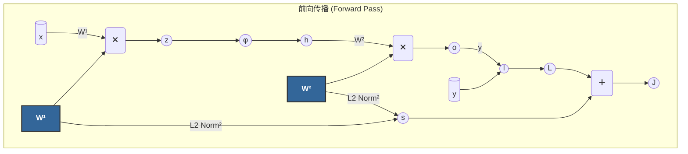
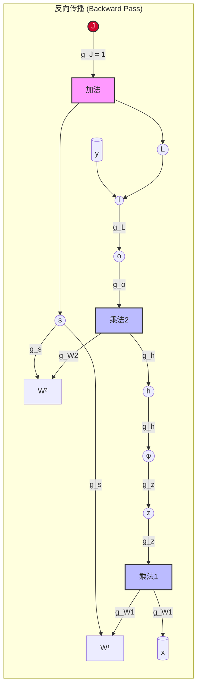

### 反向传播是链式法则在计算图上的应用

在我们开始之前，有这样一个核心思想：
*   **前向传播 (Forward Propagation)**：是一个“建造”和“计算”的过程。我们从输入开始，按照计算图的顺序，一步步计算出中间变量，直到得到最终的损失值 `J`。
*   **反向传播 (Backward Propagation)**：是一个“追责”和“分配”的过程。我们从最终的损失值 `J` 出发，按照计算图**相反**的顺序，一步步计算 `J` 对每一个参数和中间变量的梯度（偏导数）。这个过程的数学基石就是**链式法则 (Chain Rule)**。

### 第一部分 前向传播与计算图的可视化

我们首先将计算过程分解，并构建一个清晰的计算图。

#### 1. 定义模型与变量

假设我们有一个单隐藏层的 MLP，其计算步骤如下：

1.  **线性变换1**: $z = \mathbf{x}\mathbf{W}^{(1)}$ (为简化，暂时忽略偏置)
2.  **非线性激活**: $h = \phi(z)$
3.  **线性变换2**: $o = h\mathbf{W}^{(2)}$ (忽略偏置)
4.  **经验损失**: $L = l(o, y)$
5.  **正则化损失**: $s = \frac{\lambda}{2}(\|\mathbf{W}^{(1)}\|_F^2 + \|\mathbf{W}^{(2)}\|_F^2)$
6.  **最终目标函数**: $J = L + s$

这里的 $\|\cdot\|_F$ 是弗罗贝尼乌斯范数，对于矩阵来说，它等价于将矩阵展平为向量后计算 L2 范数。

#### 2. 前向计算图

*   **矩形框**：代表数据（输入 `x`、`y`，参数 `W¹`、`W²`）。
*   **圆形/椭圆框**：代表变量或操作的输出。
*   **带图标的圆形**：代表具体的操作（乘法、加法、损失函数 `l`、激活函数 `φ`）。

前向传播就是沿着箭头的方向，从左到右，一步步完成所有计算，最终得到标量 `J` 的过程。

### 推导反向传播

现在，我们进入最关键的部分：反向传播。我们将沿着计算图**从右向左**，逐个节点计算梯度。我们将计算 `J` 对图中每一个节点的偏导数。这个偏导数代表了“该节点的一个微小变动，会对最终的 `J` 产生多大的影响”。

我们将这个“影响”看作是一种从 `J` 开始，沿着图反向传播的信号。

**符号约定**:
*   我们要求解的最终目标是 $\frac{\partial J}{\partial \mathbf{W}^{(1)}}$ 和 $\frac{\partial J}{\partial \mathbf{W}^{(2)}}$。
*   `g_node` 表示梯度信号 $\frac{\partial J}{\partial \text{node}}$。例如，`g_o` 就是 $\frac{\partial J}{\partial o}$。
*   **链式法则**: 如果 $A \to B \to C$，则 $\frac{\partial C}{\partial A} = \frac{\partial C}{\partial B} \cdot \frac{\partial B}{\partial A}$。在我们的反向传播中，这意味着 `g_A = g_B * (B对A的局部梯度)`。

---

#### **第零步 起点**

梯度传播的起点是它自身。

$$
g_J = \frac{\partial J}{\partial J} = 1
$$

---

#### **第一步 J → L 和 s**

`J` 是由 `L` 和 `s` 相加得到的：$J = L + s$。这是加法门，梯度在这里会**直接分发**。

*   **对于 L**:
    
    $$
    g_L = \frac{\partial J}{\partial L} = \frac{\partial (L+s)}{\partial L} = 1
    $$
    
    直观上，`L` 增加1，`J` 也增加1。这个梯度是从 `g_J` 传递过来的：$g_L = g_J \cdot \frac{\partial J}{\partial L} = 1 \cdot 1 = 1$。
*   **对于 s**:
    
    $$
    g_s = \frac{\partial J}{\partial s} = \frac{\partial (L+s)}{\partial s} = 1
    $$

---

#### **第二步 L → o**

现在梯度信号到达了 `L`。`L` 是由 `o` 和 `y` 通过损失函数 `l` 计算得来：$L=l(o,y)$。梯度需要从 `L` 传到 `o`。

$$
g_o = \frac{\partial J}{\partial o} = \frac{\partial J}{\partial L} \cdot \frac{\partial L}{\partial o} = g_L \cdot \frac{\partial l(o,y)}{\partial o}
$$

因为 $g_L=1$，所以：

$$
g_o = \frac{\partial l(o,y)}{\partial o}
$$

这说明，在损失节点 `l` 这里，我们需要的只是**损失函数对模型输出 `o` 的局部梯度**。

---

#### **第三步 o → W² 和 h**

梯度信号 `g_o` 现在到达了节点 `o`。`o` 是由 `h` 和 `W²` 相乘得到的：$o = h\mathbf{W}^{(2)}$。这是一个乘法门，梯度在这里的传播规则是：**一个输入的梯度等于上游梯度乘以另一个输入**。（注意矩阵乘法需要转置）。

*   **对于 W²**: `W²` 的梯度有两个来源：一条路径来自 `o`，另一条直接来自 `s`。
    
    $$
    g_{W^{(2)}} = \frac{\partial J}{\partial \mathbf{W}^{(2)}} = \frac{\partial J}{\partial o} \cdot \frac{\partial o}{\partial \mathbf{W}^{(2)}} + \frac{\partial J}{\partial s} \cdot \frac{\partial s}{\partial \mathbf{W}^{(2)}}
    $$
    
    *   第一项：$\frac{\partial o}{\partial \mathbf{W}^{(2)}} = h^\top$。所以这部分是 $h^\top \cdot g_o$。
    *   第二项：$\frac{\partial s}{\partial \mathbf{W}^{(2)}} = \frac{\partial}{\partial \mathbf{W}^{(2)}}\left(\frac{\lambda}{2}\|\mathbf{W}^{(2)}\|_F^2\right) = \lambda \mathbf{W}^{(2)}$。
    *   结合起来（并注意 `prod` 符号代表了正确的矩阵运算）：
        
        $$
        g_{W^{(2)}} = \text{prod}(h^\top, g_o) + \lambda \mathbf{W}^{(2)}
        $$
        
*   **对于 h**: 梯度信号需要继续向左传播。`h` 只通过 `o` 影响 `J`。
    
    $$
    g_h = \frac{\partial J}{\partial h} = \frac{\partial J}{\partial o} \cdot \frac{\partial o}{\partial h}
    $$
    
    *   这里的局部梯度 $\frac{\partial o}{\partial h} = (\mathbf{W}^{(2)})^\top$。
    *   因此：
        
        $$
        g_h = g_o \cdot (\mathbf{W}^{(2)})^\top
        $$
        
        梯度 `g_o` 被权重矩阵 `W²` 的转置“反向传播”了回去。

---

#### **第四步 h → z**

梯度信号 `g_h` 到达了节点 `h`。`h` 是 `z` 经过**逐元素**激活函数 $\phi$ 得到的：$h = \phi(z)$。对于逐元素操作，链式法则是逐元素相乘（即哈达玛积 $\odot$）。

$$
g_z = \frac{\partial J}{\partial z} = \frac{\partial J}{\partial h} \cdot \frac{\partial h}{\partial z} = g_h \odot \phi'(z)
$$

这里的 $\phi'(z)$ 是激活函数 $\phi$ 对其输入 `z` 的导数，也是一个和 `z` 同形状的矩阵。

---

#### **第五步 z → W¹ 和 x**

梯度信号 `g_z` 到达了节点 `z`。`z` 是由 `x` 和 `W¹` 相乘得到的：$z = x\mathbf{W}^{(1)}$。

*   **对于 W¹**: 和 `W²` 类似，`W¹` 的梯度也来自两条路径。
    
    $$
    g_{W^{(1)}} = \frac{\partial J}{\partial \mathbf{W}^{(1)}} = \frac{\partial J}{\partial z} \cdot \frac{\partial z}{\partial \mathbf{W}^{(1)}} + \frac{\partial J}{\partial s} \cdot \frac{\partial s}{\partial \mathbf{W}^{(1)}}
    $$
    
    *   第一项：$\frac{\partial z}{\partial \mathbf{W}^{(1)}} = x^\top$。所以这部分是 $x^\top \cdot g_z$。
    *   第二项：$\frac{\partial s}{\partial \mathbf{W}^{(1)}} = \lambda \mathbf{W}^{(1)}$。
    *   结合起来：
        
        $$
        g_{W^{(1)}} = \text{prod}(x^\top, g_z) + \lambda \mathbf{W}^{(1)}
        $$
        
*   **对于 x**: 虽然我们通常不计算对输入的梯度（除非有特殊目的），但为了完整性，梯度会继续传播到 `x`：$g_x = g_z \cdot (\mathbf{W}^{(1)})^\top$。

至此，我们已经成功地从 `J` 出发，反向计算出了模型所有参数（`W¹`, `W²`）的梯度。这就是一次完整的反向传播。

### 第三部分 反向传播的计算图可视化

现在，我们将上述的梯度计算过程也绘制在图上，箭头代表着梯度信号的流动方向。

1.  **从 `J` 开始**：梯度流的源头是 `J`，初始值为1。
2.  **加法门 (`+`)**：梯度从 `g_J` (值为1) 直接“复制”并分发给 `L` 和 `s`。
3.  **损失门 (`l`)**：`g_L` 乘以损失函数对 `o` 的局部导数，得到 `g_o`。
4.  **乘法门 (mul2)**：`g_o` 分流到 `h` 和 `W²`。流向 `h` 的是 `g_o` 乘以 `W²` 的转置；流向 `W²` 的是 `g_o` 乘以 `h` 的转置。
5.  **正则化路径 (`s`)**: `g_s` (值为1) 直接乘以正则化项对 `W¹` 和 `W²` 的局部导数（即 `λW¹` 和 `λW²`），贡献到最终的参数梯度中。
6.  **激活门 (`φ`)**：`g_h` 逐元素乘以激活函数的导数 `φ'(z)`，得到 `g_z`。
7.  **乘法门 (mul1)**：`g_z` 以类似的方式分流，计算出 `g_{W¹}` 的一部分。