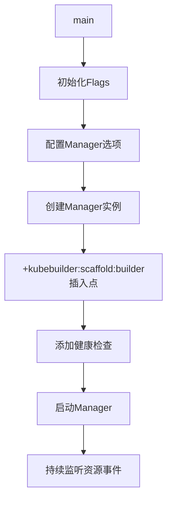
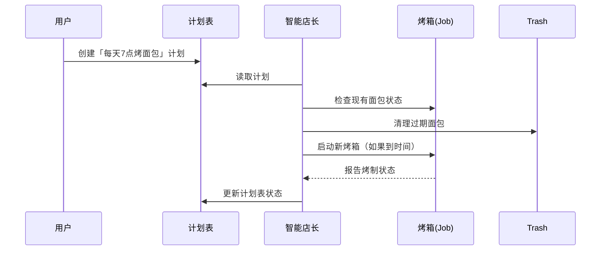
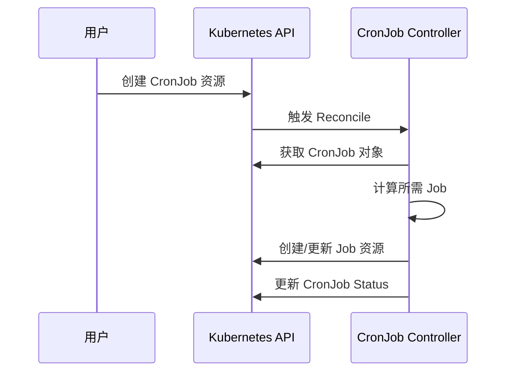

> 本篇基于 [kubebuilder book cronjob tutorial](https://book.kubebuilder.io/cronjob-tutorial/cronjob-tutorial) 完成

> [!summary] 
> Kubebuilder是一个用于构建Kubernetes控制器的工具。它能帮助开发者更高效地开发在Kubernetes集群上运行的控制器程序。例如，当我们想要创建像CronJob这样的资源以及其配套的控制器时，Kubebuilder可以简化开发过程。它可以为项目搭建初始框架，像创建项目目录、初始化项目结构等，让开发者从一个基础的架构开始进行更深入的开发工作，避免了从头开始构建复杂的项目基础架构，提高开发效率。

## 开始吧！首先创建我们的项目

### 确认已经安装了 `kubebuilder`

- 如果没有安装过，可以使用以下官方命令安装最新版
```shell
# download kubebuilder and install locally.
curl -L -o kubebuilder "https://go.kubebuilder.io/dl/latest/$(go env GOOS)/$(go env GOARCH)"
chmod +x kubebuilder && sudo mv kubebuilder /usr/local/bin/
```
- 不过我更想推荐一个用于k8s常用二进制文件管理的工具 `arkade` 
	- [](https://github.com/alexellis/arkade)
	- 安装后将 `arkade` 路径加到 `PATH` 后，使用 `arkade get kubebuilder` 就可以正常使用了（有时候安装可能需要指定一下版本，貌似kubebuilder对版本要求还是有的）

### 创建项目

```shell
# create a project directory, and then run the init command.
mkdir project
cd project
# we'll use a domain of tutorial.kubebuilder.io,
# so all API groups will be <group>.tutorial.kubebuilder.io.
kubebuilder init --domain tutorial.kubebuilder.io --repo tutorial.kubebuilder.io/project
```

然后，`kubebuilder` 就会为你创建一些目录、`Makefile`等文件。

```shell
INFO Writing kustomize manifests for you to edit... 
INFO Writing scaffold for you to edit...          
INFO Get controller runtime:
$ go get sigs.k8s.io/controller-runtime@v0.20.2
```

我们打开目录可以发现以下结构：

```markdown

project

├─ .devcontainer

│  ├─ devcontainer.json

│  └─ post-install.sh

├─ .dockerignore

├─ .golangci.yml

├─ Dockerfile

├─ Makefile

├─ PROJECT

├─ README.md

├─ cmd

│  └─ main.go

├─ config

│  ├─ default

│  │  ├─ cert_metrics_manager_patch.yaml

│  │  ├─ kustomization.yaml

│  │  ├─ manager_metrics_patch.yaml

│  │  └─ metrics_service.yaml

│  ├─ manager

│  │  ├─ kustomization.yaml

│  │  └─ manager.yaml

│  ├─ network-policy

│  │  ├─ allow-metrics-traffic.yaml

│  │  └─ kustomization.yaml

│  ├─ prometheus

│  │  ├─ kustomization.yaml

│  │  ├─ monitor.yaml

│  │  └─ monitor_tls_patch.yaml

│  └─ rbac

│     ├─ kustomization.yaml

│     ├─ leader_election_role.yaml

│     ├─ leader_election_role_binding.yaml

│     ├─ metrics_auth_role.yaml

│     ├─ metrics_auth_role_binding.yaml

│     ├─ metrics_reader_role.yaml

│     ├─ role.yaml

│     ├─ role_binding.yaml

│     └─ service_account.yaml

├─ go.mod

├─ go.sum

├─ hack

│  └─ boilerplate.go.txt

└─ test

   ├─ e2e

   │  ├─ e2e_suite_test.go

   │  └─ e2e_test.go

   └─ utils

      └─ utils.go

```

### 项目的基本结构
在官方文档中，重点强调了以下几个文件：
- `go.mod`: 是Go项目模块基本文件，说明了库、go版本以及依赖。而目前生成的项目go语言版本为1.23。
- `Makefile`: 提供了用于构建我们的项目的一些 `Makefile` 命令，主要用于 Kubernetes Operator/Controller 的开发和部署，提供了完整的开发、测试、构建和部署工具链。
	- `make all` - 构建项目
	- `make help` - 显示帮助信息
	- `make manifests` - 生成 WebhookConfiguration、ClusterRole 和 CRD 对象 
	- `make generate` - 生成 DeepCopy 相关代码实现
	- `make fmt` - 运行 go fmt 格式化代码
	- `make vet` - 运行 go vet 检查代码
	- `make test` - 运行单元测试
	- `make test-e2e` - 运行端到端测试
	- `make lint` - 运行 golangci-lint 代码检查
	- `make lint-fix` - 运行 golangci-lint 并自动修复问题
	- `make lint-config` - 验证 golangci-lint 配置
	- `make build` - 构建项目二进制文件
	- `make run` - 在本地运行控制器
	- `make docker-build` - 构建 Docker 镜像
	- `make docker-push` - 推送 Docker 镜像到仓库
	- `make docker-buildx` - 构建并推送多架构 Docker 镜像
	- `make build-installer` - 生成包含 CRD 和部署配置的完整 YAML
	- `make install` - 将 CRD 安装到 Kubernetes 集群
	- `make uninstall` - 从集群中卸载 CRD 
	- `make deploy` - 部署控制器到集群
	- `make undeploy` - 从集群中卸载控制器
	- `make kustomize` - 安装 kustomize 工具
	- `make controller-gen` - 安装 controller-gen 工具
	- `make setup-envtest` - 安装测试环境所需的二进制文件
	- `make golangci-lint` - 安装 golangci-lint 工具
- `PROJECT`: 项目的元数据。

### 启动配置（Config）

在`config/`目录下，我们还能找到启动配置（主要还是一些Yaml文件）。目前，这里面仅包含在集群上启动控制器所需的Kustomize YAML定义。[Kustomize](https://github.com/kubernetes-sigs/kustomize)是一种用于定制和管理Kubernetes配置的工具，通过这些YAML定义，可以方便地对控制器进行部署相关的设置。不过，当我们着手编写控制器时，这个目录的作用会更加丰富，它还将存放自定义资源定义（CustomResourceDefinitions）、基于角色的访问控制（RBAC）配置以及Webhook配置。
自定义资源定义能够让用户在Kubernetes集群中创建和管理自己的资源类型；RBAC配置则用于精确控制不同服务账号对集群资源的访问权限，保障系统的安全性；Webhook配置主要用于在资源创建、更新或删除等操作时触发自定义的逻辑。
- `config/default`目录中包含了一个用于以标准配置启动控制器的Kustomize基础配置。这就像是一个默认的模板，为控制器的启动提供了一套标准的参数和设置，使得我们在启动控制器时可以基于这个基础快速进行部署。
- 而其他每个目录都包含不同的配置内容，并且都被重构为各自独立的基础配置。
- `config/manager`目录的作用是将控制器以Pod的形式在集群中启动。Pod是Kubernetes中最小的可部署和可管理的计算单元，把控制器作为Pod启动，能够利用Kubernetes强大的容器编排和管理能力，实现对控制器的高效运行和管理。
- `config/rbac`目录则是为运行控制器的服务账号设置所需的权限。每个服务账号都有其特定的权限范围，通过在这个目录中进行配置，可以确保控制器在运行时，能够以安全且符合业务需求的方式访问集群资源，避免权限不足导致功能无法正常实现，或者权限过大带来的安全风险 。

### 程序的入口

> 每一段旅行都有起点，而我们的程序也需要一个入口。

在我们新建项目之后，我们可能会很疑惑，我们的程序入口去哪了？我该怎么把它跑起来？而这个文件，目前就藏在我们的 `cmd` 目录下。
它是一个典型的 Kubernetes Operator 控制器的入口文件，提供了完整的运行时配置、安全性和可观测性支持。它使用了 controller-runtime 框架，简化了控制器的开发和部署。

```go
// cmd/main.go
import (
    "crypto/tls"
    "flag"
    "os"
    "path/filepath"

    // Import all Kubernetes client auth plugins (e.g. Azure, GCP, OIDC, etc.)
    // to ensure that exec-entrypoint and run can make use of them.
    _ "k8s.io/client-go/plugin/pkg/client/auth"
  
    "k8s.io/apimachinery/pkg/runtime"
    utilruntime "k8s.io/apimachinery/pkg/util/runtime"
    clientgoscheme "k8s.io/client-go/kubernetes/scheme"
    ctrl "sigs.k8s.io/controller-runtime"
    "sigs.k8s.io/controller-runtime/pkg/certwatcher"
    "sigs.k8s.io/controller-runtime/pkg/healthz"
    "sigs.k8s.io/controller-runtime/pkg/log/zap"
    "sigs.k8s.io/controller-runtime/pkg/metrics/filters"
    metricsserver "sigs.k8s.io/controller-runtime/pkg/metrics/server"
    "sigs.k8s.io/controller-runtime/pkg/webhook"
    // +kubebuilder:scaffold:imports

)
```

我们的程序导入了几个比较重要的包
- 核心运行时包，这些包提供了与 Kubernetes API 交互的基础功能和认证支持。
```go
_ "k8s.io/client-go/plugin/pkg/client/auth"  // Kubernetes 认证插件
"k8s.io/apimachinery/pkg/runtime"            // Kubernetes 运行时核心包
clientgoscheme "k8s.io/client-go/kubernetes/scheme" // Kubernetes 资源类型注册表
```
- Controller Runtime 核心包，这是构建 Kubernetes controller 的核心包，提供了管理器、控制器、客户端等基础组件。官方文档还重点强调了默认使用日志组件的为 `Zap`
```go
ctrl "sigs.k8s.io/controller-runtime"  // controller-runtime 的主要功能包
"sigs.k8s.io/controller-runtime/pkg/healthz"           // 健康检查
"sigs.k8s.io/controller-runtime/pkg/metrics/filters"   // 指标过滤器
metricsserver "sigs.k8s.io/controller-runtime/pkg/metrics/server"  // 指标服务器
"sigs.k8s.io/controller-runtime/pkg/certwatcher"  // 证书监控
"sigs.k8s.io/controller-runtime/pkg/webhook"      // Webhook 服务器
"sigs.k8s.io/controller-runtime/pkg/log/zap"  // 结构化日志
```

然后，`main`文件接下来做了一些如下的事情：
#### `// +kubebuilder:scaffold:builder` 注释
- **代码生成锚点**：这是Kubebuilder的脚手架标记，后续通过`kubebuilder create api`生成的控制器(Controller)、Webhook等代码将**自动插入到此处**。
- **动态扩展性**：当运行`make generate`或`make manifests`时，工具会根据CRD定义在此位置下方生成`SetupWithManager`等关键代码。
- 不过不要手动修改此标记的位置或删除它，否则会导致代码生成错乱。
#### 全局变量和初始化
```go
var (
    scheme   = runtime.NewScheme()        // Kubernetes 资源注册表
    setupLog = ctrl.Log.WithName("setup") // 日志对象
)

// init是go语言导入包时默认会执行的函数
func init() {
    // 注册 Kubernetes 核心资源类型到 scheme
    utilruntime.Must(clientgoscheme.AddToScheme(scheme))
}
```


#### 主要流程(main 函数)
1. **配置解析**
	```go
	// 定义和解析命令行参数
	var metricsAddr string
	var enableLeaderElection bool
	// ... 其他配置项
	flag.Parse()
	```
2. **日志配置**
	```go
	// 配置 zap 日志
	ctrl.SetLogger(zap.New(zap.UseFlagOptions(&opts)))
	```
3. **TLS 和证书配置**
	- 配置 HTTP/2 支持
	- 设置度量指标和 webhook 的证书监视器
	- 处理 TLS 选项
4. **Manager 配置和启动**
	```go
	mgr, err := ctrl.NewManager(ctrl.GetConfigOrDie(), ctrl.Options{
		Scheme:                 scheme,
		Metrics:               metricsServerOptions,
		WebhookServer:         webhookServer,
		HealthProbeBindAddress: probeAddr,
		LeaderElection:        enableLeaderElection,
		// ... 其他选项
	})
	```
5. **健康检查配置**
	```go
	// 添加存活和就绪探针
	mgr.AddHealthzCheck("healthz", healthz.Ping)
	mgr.AddReadyzCheck("readyz", healthz.Ping)
	```
#### 主要功能特性
1. **领导者选举**
	- 支持多副本部署时的领导者选举
	- 确保只有一个控制器实例活跃
2. **安全特性**
	- 支持 TLS 证书的动态加载和监控
	- 可配置的 HTTP/2 支持(默认禁用以防止漏洞)
	- 度量指标的安全访问控制
3. **可观测性**
	- 健康检查接口(/healthz, /readyz)
	- 度量指标服务器
	- 结构化日志输出
4. **优雅关闭**
	- 信号处理
	- 领导者选举状态清理
	- 资源释放

## _groups_, _versions_, _kinds_, and _resources_

### 核心术语

1. **API组（Groups）**：Kubernetes中相关功能的集合，每个组包含一个或多个版本，版本用于随时间改变API的工作方式。例如 `core` 就是k8s核心功能组。
2. **版本（Versions）**：与API组关联，允许API在不同阶段进行功能变更。
3. **种类（Kinds）**：每个API组 - 版本包含的API类型。不同版本的Kind形式可能变化，但需确保数据存储兼容，使用旧版本API不会丢失或损坏新数据。
4. **资源（Resources）**：是Kind在API中的使用。通常Kinds和Resources一一对应，如`pods`资源对应`Pod` Kind 。但有时同一Kind可由多个资源返回，如`Scale` Kind 。在CRDs（自定义资源定义）中，每个Kind对应单个资源，且资源名通常为Kind的小写形式。
### 与Go的关联
在Go中，特定组 - 版本中的Kind被称为`GroupVersionKind`（GVK），资源则称为`GroupVersionResource`（GVR）。每个GVK对应一个Go包中的根类型。
### 创建API
使用`kubebuilder create api`命令创建自定义资源（CR）和自定义资源定义（CRD），目的是让Kubernetes认识自定义对象。Go结构体用于生成CRD，CRD定义数据模式等，CR是自定义对象的实例，由控制器管理。有关内容可以进一步了解 [Extend the Kubernetes API with CustomResourceDefinitions](https://kubernetes.io/docs/tasks/extend-kubernetes/custom-resources/custom-resource-definitions/)
### 示例
在Kubernetes部署应用和数据库场景中，可用一个CRD代表应用，另一个代表数据库。这样符合封装、单一职责和内聚原则，利于扩展、复用和维护。应用CRD的控制器负责创建包含应用的Deployment和访问服务，数据库CRD的控制器管理数据库实例。
### Scheme的作用
Scheme用于跟踪特定GVK对应的Go类型。例如标记`"tutorial.kubebuilder.io/api/v1".CronJob{}`属于`batch.tutorial.kubebuilder.io/v1` API组（Kind为`CronJob`），之后可根据API服务器的JSON构建新的`&CronJob{}` ，或在更新时查找组 - 版本。

## 让我们添加一个Cronjob API吧

在之前的工作中，我们只搭好了一个基本的脚手架以及解释了一下基本的结构，但是这对于我们的 `Cronjob` 还完全不够。或许现在，我们需要进一步填充我们的内容了。
首先——先把API建立起来吧。
```shell
╰─(base) ○ kubebuilder create api --group batch --version v1 --kind CronJob

INFO Create Resource [y/n]                        
y
INFO Create Controller [y/n]                      
y
INFO Writing kustomize manifests for you to edit... 
INFO Writing scaffold for you to edit...          
INFO api/v1/cronjob_types.go                      
INFO api/v1/groupversion_info.go                  
INFO internal/controller/suite_test.go            
INFO internal/controller/cronjob_controller.go    
INFO internal/controller/cronjob_controller_test.go 
INFO Update dependencies:
$ go mod tidy           
INFO Running make:
$ make generate                
mkdir -p /home/lee/go/src/project/bin
Downloading sigs.k8s.io/controller-tools/cmd/controller-gen@v0.17.2
go: downloading sigs.k8s.io/controller-tools v0.17.2
go: downloading github.com/gobuffalo/flect v1.0.3
go: downloading github.com/fatih/color v1.18.0
go: downloading golang.org/x/net v0.34.0
go: downloading github.com/mattn/go-colorable v0.1.13
/home/lee/go/src/project/bin/controller-gen object:headerFile="hack/boilerplate.go.txt" paths="./..."
Next: implement your new API and generate the manifests (e.g. CRDs,CRs) with:
$ make manifests
```
在上面的步骤中，我们使用 `kubebuilder` 创建了 `Cronjob` 对应的资源清单文件以及对应的控制器文件。而在上面的内容中，主要涉及到了几个参数：
    - `--group batch`：定义 API 组名为 `batch`
    - `--version v1`：版本号为 `v1`
    - `--kind CronJob`：资源类型名为 `CronJob`
我们会发现，当前项目空间下多了两个目录：`api/v1` 和 `internal/controller`。另外，新的CRD清单也在`config/crd/` 以及相关的目录下生成了。

--- 
#### API类型定义

在 **`api/v1/cronjob_types.go`** 文件中，我们能够看到核心的结构体定义：

```go
// CronJobSpec 用户定义的**期望状态**（如副本数、镜像版本）
type CronJobSpec struct {
    // 重要：添加字段后需运行 make 重新生成代码
}

// CronJobStatus 系统维护的**实际状态**（如当前运行的 Pod 列表）
type CronJobStatus struct {
    // 状态字段需反映集群实际状态
}
```

而我们的Kind主体定义则如下：

```go
// +kubebuilder:object:root=true
// +kubebuilder:subresource:status
type CronJob struct {
    metav1.TypeMeta   `json:",inline"`
    metav1.ObjectMeta `json:"metadata,omitempty"`  // 包含 name, namespace, labels 等
    Spec   CronJobSpec   `json:"spec,omitempty"`
    Status CronJobStatus `json:"status,omitempty"`
}
```
- **关键标记**：
    - `+kubebuilder:object:root=true`：声明此类型为根资源类型
    - `+kubebuilder:subresource:status`：启用 status 子资源，允许单独更新 status
另外，还提供了列表定义，用于批量操作，例如 `kubectl get cronjobs`

```go
// +kubebuilder:object:root=true
type CronJobList struct {
    metav1.TypeMeta `json:",inline"`
    metav1.ListMeta `json:"metadata,omitempty"` // 分页等信息
    Items []CronJob `json:"items"`              // 实际资源列表
}
```

最后，我们还要通过 `init` 函数将 Scheme 注册到我们 k8s 的系统中，以便于进行序列化和反序列化。

```go
func init() {
    SchemeBuilder.Register(&CronJob{}, &CronJobList{})
}
```

---
#### **代码生成**

- 我们会发现，在我们创建api时，执行了两条**执行生成命令**：

  ```bash
    make manifests  # 生成 CRD YAML 文件
    make generate   # 生成 DeepCopy 方法
    ```
- 相关的一些文件被生成了：
  - `zz_generated.deepcopy.go`：自动生成的深拷贝方法
  - `groupversion_info.go`：版本信息并注册到 Scheme 中。
  - `config/crd/bases/`：CRD 的 YAML 定义文件

---
#### Cronjob Sepc与Status
1. **定义 Spec 字段**：
   ```go
   type CronJobSpec struct {
       Schedule   string `json:"schedule"`   // Cron 表达式
       JobTemplate batchv1.JobTemplateSpec `json:"jobTemplate"`
   }
   ```
2. **定义 Status 字段**：
   ```go
   type CronJobStatus struct {
       Active []corev1.ObjectReference `json:"active,omitempty"`
       LastScheduleTime *metav1.Time   `json:"lastScheduleTime,omitempty"`
   }
   ```
3. **添加字段验证**：
   ```go
   // +kubebuilder:validation:Pattern=`^(\d+|\*)(/\d+)?(\s+(\d+|\*)(/\d+)?){4}$`
   Schedule string `json:"schedule"`
   ```

需要注意的是，文档里提到了：
- 所有序列化的字段必须是驼峰命名法，所以使用 JSON 结构体标签来指定这一点。还可以使用 omitempty 结构体标签来标记当字段为空时在序列化中应被省略。
- 字段可以使用大多数的基本类型。数字是个例外：出于 API 兼容性的目的，接受三种数字形式：int32 和 int64 用于整数，以及 resource.Quantity 用于小数。
- 还有一种特殊类型被使用：metav1.Time。它的功能与 time.Time 完全相同，只是它具有固定的、可移植的序列化格式。

而以下是官方提供的一个比较全面的 `CronJob` 的定义。

> [!example]- CronJobSpec
> ```go
> // CronJobSpec defines the desired state of CronJob.
> type CronJobSpec struct {
>     // +kubebuilder:validation:MinLength=0
> 
>     // The schedule in Cron format, see https://en.wikipedia.org/wiki/Cron.
>     Schedule string `json:"schedule"`
> 
>     // +kubebuilder:validation:Minimum=0
> 
>     // Optional deadline in seconds for starting the job if it misses scheduled
>     // time for any reason.  Missed jobs executions will be counted as failed ones.
>     // +optional
>     StartingDeadlineSeconds *int64 `json:"startingDeadlineSeconds,omitempty"`
> 
>     // Specifies how to treat concurrent executions of a Job.
>     // Valid values are:
>     // - "Allow" (default): allows CronJobs to run concurrently;
>     // - "Forbid": forbids concurrent runs, skipping next run if previous run hasn't finished yet;
>     // - "Replace": cancels currently running job and replaces it with a new one
>     // +optional
>     ConcurrencyPolicy ConcurrencyPolicy `json:"concurrencyPolicy,omitempty"`
> 
>     // This flag tells the controller to suspend subsequent executions, it does
>     // not apply to already started executions.  Defaults to false.
>     // +optional
>     Suspend *bool `json:"suspend,omitempty"`
> 
>     // Specifies the job that will be created when executing a CronJob.
>     JobTemplate batchv1.JobTemplateSpec `json:"jobTemplate"`
> 
>     // +kubebuilder:validation:Minimum=0
> 
>     // The number of successful finished jobs to retain.
>     // This is a pointer to distinguish between explicit zero and not specified.
>     // +optional
>     SuccessfulJobsHistoryLimit *int32 `json:"successfulJobsHistoryLimit,omitempty"`
> 
>     // +kubebuilder:validation:Minimum=0
> 
>     // The number of failed finished jobs to retain.
>     // This is a pointer to distinguish between explicit zero and not specified.
>     // +optional
>     FailedJobsHistoryLimit *int32 `json:"failedJobsHistoryLimit,omitempty"`
> }
> 
> > // ConcurrencyPolicy describes how the job will be handled.
> // Only one of the following concurrent policies may be specified.
> // If none of the following policies is specified, the default one
> // is AllowConcurrent.
> // +kubebuilder:validation:Enum=Allow;Forbid;Replace
> type ConcurrencyPolicy string
> 
> const (
>     // AllowConcurrent allows CronJobs to run concurrently.
>     AllowConcurrent ConcurrencyPolicy = "Allow"
> 
>     // ForbidConcurrent forbids concurrent runs, skipping next run if previous
>     // hasn't finished yet.
>     ForbidConcurrent ConcurrencyPolicy = "Forbid"
> 
>     // ReplaceConcurrent cancels currently running job and replaces it with a new one.
>     ReplaceConcurrent ConcurrencyPolicy = "Replace"
> )
> ```

以上定义了 CronJobSpec 结构体，包含 Schedule（任务调度时间）、StartingDeadlineSeconds（任务启动截止时间）、ConcurrencyPolicy（任务并发策略）、Suspend（是否暂停任务）、JobTemplate（任务模板）、SuccessfulJobsHistoryLimit（成功任务历史记录保留数量）和 FailedJobsHistoryLimit（失败任务历史记录保留数量）这些字段。

在这上面，还使用 `// +kubebuilder:validation:` 的注释来限制了字段的值的取值范围，使用 `// +optional` 等来判断是否字段可选等。

而 CronJobStatus 中，则需要定义对正在运行的任务的引用以及上一次任务调度时间的记录。

```go
// CronJobStatus defines the observed state of CronJob.
type CronJobStatus struct {
    // INSERT ADDITIONAL STATUS FIELD - define observed state of cluster
    // Important: Run "make" to regenerate code after modifying this file

    // A list of pointers to currently running jobs.
    // +optional
    Active []corev1.ObjectReference `json:"active,omitempty"`

    // Information when was the last time the job was successfully scheduled.
    // +optional
    LastScheduleTime *metav1.Time `json:"lastScheduleTime,omitempty"`
}
```


---

## 完善我们的控制器逻辑吧

#### **控制器关联逻辑与控制器机制**

在 Kubernetes 生态中，控制器（Controller） 是维持系统状态一致性的核心引擎。它像一个永不疲倦的观察者，时刻对比着用户定义的==“期望状态”==（如 YAML 文件中声明的副本数量）与==集群的“实际状态”==（如当前运行的 Pod 数量），并通过一系列操作弥合两者之间的差距。这种持续协调的过程，我们称之为 ==调和（Reconciling==）。

##### **控制器的核心职责**

想象这样一个场景：你定义了一个 `CronJob` 资源，要求每分钟执行一次任务。控制器的工作便是确保：
1. 每分钟生成一个对应的 `Job` 对象
2. 监控这些 `Job` 的执行状态
3. 清理过期的历史任务
4. 当手动删除 `CronJob` 时，自动清理关联资源
这一系列动作的背后，正是控制器通过 **调和循环（Reconcile Loop）** 实现的。每一次资源的创建、更新或删除事件，都会触发控制器的调和逻辑。

而在此前的命令执行后，生成了 **Controller 文件** ：`controllers/cronjob_controller.go`

---

##### **解剖一个控制器的代码结构**
以 Kubebuilder 生成的 `CronJobReconciler` 为例：

```go
type CronJobReconciler struct {
    client.Client     // 与 Kubernetes API 交互的客户端
    Scheme *runtime.Scheme // 管理 API 对象的类型系统
}
```

- **client.Client**：这是控制器与 Kubernetes API Server 通信的桥梁。通过它，控制器可以查询集群状态（如获取某个 `CronJob` 实例）、修改资源（如更新状态字段）、创建新资源（如生成 `Job` 对象）。
- **runtime.Scheme**：如同一个类型注册表，它记录了如何将 Kubernetes 的 API 对象（如自定义的 `CronJob`）与 Go 语言的结构体相互转换。这确保了当控制器从 API Server 接收到二进制数据时，能正确反序列化为具体的 Go 对象。



---

##### **权限控制：RBAC 标记**
控制器需要明确的权限才能操作集群资源，而这通过代码中的特殊注释实现：
```go
// +kubebuilder:rbac:groups=batch.tutorial.kubebuilder.io,resources=cronjobs,verbs=get;list;watch;create;update;patch;delete
// +kubebuilder:rbac:groups=batch.tutorial.kubebuilder.io,resources=cronjobs/status,verbs=get;update;patch
```
- **作用机制**：当运行 `make manifests` 时，Kubebuilder 会读取这些标记，自动生成位于 `config/rbac/role.yaml` 的 RBAC 配置文件。例如：
  ```yaml
  apiVersion: rbac.authorization.k8s.io/v1
  kind: ClusterRole
  rules:
  - apiGroups: ["batch.tutorial.kubebuilder.io"]
    resources: ["cronjobs"]
    verbs: ["get", "list", "watch", "create", "update", "patch", "delete"]
  ```
- **最小权限原则**：初始生成的权限是基础的读写权限。当控制器需要操作其他资源（如创建 `Pod` 或 `Job`）时，必须显式添加对应的 RBAC 标记。

---

#### **调和逻辑的核心：Reconcile 方法**
```go
func (r *CronJobReconciler) Reconcile(ctx context.Context, req ctrl.Request) (ctrl.Result, error) {
    logger := log.FromContext(ctx)
    logger.Info("开始调和", "cronjob", req.NamespacedName)

    // 步骤 1：获取目标 CronJob 对象
    var cronJob batchv1.CronJob
    if err := r.Get(ctx, req.NamespacedName, &cronJob); err != nil {
        return ctrl.Result{}, client.IgnoreNotFound(err)
    }

    // 步骤 2：执行业务逻辑（例如检查 Job 状态、创建新 Job）
    // ...

    // 步骤 3：更新状态
    if err := r.Status().Update(ctx, &cronJob); err != nil {
        return ctrl.Result{}, err
    }

    return ctrl.Result{}, nil
}
```

- **触发条件**：当与 `CronJob` 相关的任何事件发生时（包括关联资源的变化），此方法会被调用。`req` 参数携带了触发事件的对象标识（名称和命名空间）。
- **上下文传递**：`ctx` 参数承载超时控制、追踪信息等，需贯穿所有 API 调用，确保可观测性和资源泄漏防护。
- **错误处理**：返回错误会导致控制器重试（默认间隔逐渐增加）。若明确无需重试（如资源已删除），可返回 `client.IgnoreNotFound`。

---

##### **控制器的注册与监听**
```go
func (r *CronJobReconciler) SetupWithManager(mgr ctrl.Manager) error {
    return ctrl.NewControllerManagedBy(mgr).
        For(&batchv1.CronJob{}).          // 监听 CronJob 主资源
        Owns(&kbatchv1.Job{}).            // 监听子资源 Job 的变化
        Complete(r)
}
```

- **层级监听**：
  - `For(&batchv1.CronJob{})`：声明控制器主要处理 `CronJob` 类型的事件。
  - `Owns(&kbatchv1.Job{})`：当 `CronJob` 创建的 `Job` 发生变更时，也会触发对应父 `CronJob` 的调和。这避免了手动管理父子资源的关系。
- **高效缓存**：Controller-Runtime 会为监听的资源类型建立本地缓存，减少对 API Server 的直接查询压力。

---

##### **调和过程中的日志**
```go
logger := log.FromContext(ctx)
logger.Info("检测到 CronJob 变更", 
    "namespace", req.Namespace,
    "name", req.Name,
    "schedule", cronJob.Spec.Schedule)
```
- **结构化日志**：采用键值对形式（如 `"schedule": "*/5 * * * *"`），便于日志系统（如 ELK、Loki）进行过滤与分析。
- **日志级别**：通过 `V()` 方法控制详细程度：
  ```go
  logger.V(1).Info("调试信息", "activeJobs", len(activeJobs))
  ```

---

##### **控制器的生命周期**
当 Manager 启动时（通过 `mgr.Start`），所有注册的控制器会启动各自的调和循环：
1. **事件监听**：通过 Informer 机制监听 API Server 的资源变更事件。
2. **工作队列**：将事件转化为任务项（Work Item）加入队列，实现异步处理与重试。
3. **并发控制**：默认每个控制器启动多个 Worker 并行处理任务，可通过 `MaxConcurrentReconciles` 调整。

---

##### 实践
1. **幂等性设计**：确保调和逻辑多次执行结果一致，避免重复创建资源。
2. **状态更新分离**：修改 `Spec` 需通过 `Update`，而更新 `Status` 应使用 `Status().Update`，以符合 Kubernetes 的语义。
3. **资源清理策略**：通过 Finalizers 机制实现删除前的资源回收，防止残留对象。

---

#### **完整工作流程**


---

#### 实现我们的 `cronjob_controller`

> 由于内容较多，暂时只做翻译

##### 实现控制器
我们的CronJob控制器的基本逻辑是这样的：
1. 加载命名的CronJob。
2. 列出所有活动作业，并更新状态。
3. 根据历史限制清理旧作业。
4. 检查我们是否被暂停（如果被暂停，请不要做任何其他事情）。
5. 获取下一次计划运行。
6. 如果新作业按计划进行，未超过截止日期，并且未被我们的并发策略阻止，则运行新作业。
7. 当我们看到正在运行的作业（自动完成）或下一次计划运行时，请重新排队。

文件路径：project/internal/controller/cronjob_controller.go
许可证：Apache License

我们将从一些导入开始。您将在下面看到，我们需要的导入比为我们搭建的脚手架多一些。当我们使用它时，我们会讨论每一个。
```go
package controller

import (
    "context"
    "fmt"
    "sort"
    "time"
    "github.com/robfig/cron"
    kbatch "k8s.io/api/batch/v1"
    corev1 "k8s.io/api/core/v1"
    metav1 "k8s.io/apimachinery/pkg/apis/meta/v1"
    "k8s.io/apimachinery/pkg/runtime"
    ref "k8s.io/client-go/tools/reference"
    ctrl "sigs.k8s.io/controller-runtime"
    "sigs.k8s.io/controller-runtime/pkg/client"
    "sigs.k8s.io/controller-runtime/pkg/log"
    batchv1 "tutorial.kubebuilder.io/project/api/v1"
)
```
接下来，我们需要一个Clock，这将允许我们在测试中伪造时间。
```go
// CronJobReconciler协调CronJob对象
type CronJobReconciler struct {
    client.Client
    Scheme *runtime.Scheme
    Clock
}
```
我们将模拟时钟，以便在测试时更轻松地跳转时间，“真正的”时钟只是调用time.Now。
```go
type realClock struct{}

func (_ realClock) Now() time.Time { return time.Now() }

// Clock知道如何获取当前时间。
// 它可用于在测试中伪造时间。
type Clock interface {
    Now() time.Time
}
```
请注意，我们需要更多的RBAC权限 – 由于我们现在正在创建和管理作业，因此我们需要这些权限，这意味着需要添加更多标记。
```go
// +kubebuilder:rbac:groups=batch.tutorial.kubebuilder.io,resources=cronjobs,verbs=get;list;watch;create;update;patch;delete
// +kubebuilder:rbac:groups=batch.tutorial.kubebuilder.io,resources=cronjobs/status,verbs=get;update;patch
// +kubebuilder:rbac:groups=batch.tutorial.kubebuilder.io,resources=cronjobs/finalizers,verbs=update
// +kubebuilder:rbac:groups=batch,resources=jobs,verbs=get;list;watch;create;update;patch;delete
// +kubebuilder:rbac:groups=batch,resources=jobs/status,verbs=get
```
现在，我们进入控制器的核心 – 协调器逻辑。
```go
var (
    scheduledTimeAnnotation = "batch.tutorial.kubebuilder.io/scheduled-at"
)

// Reconcile是主要的Kubernetes协调循环的一部分，旨在使集群的当前状态更接近所需状态。
// TODO(user)：修改Reconcile函数，将CronJob对象指定的状态与实际集群状态进行比较，然后
// 执行操作以使集群状态反映用户指定的状态。
//
// 有关更多详细信息，请在此处查看Reconcile及其结果：
// - https://pkg.go.dev/sigs.k8s.io/controller-runtime@v0.20.2/pkg/reconcile
// nolint:gocyclo
func (r *CronJobReconciler) Reconcile(ctx context.Context, req ctrl.Request) (ctrl.Result, error) {
    log := log.FromContext(ctx)
```
1. **按名称加载CronJob**：我们将使用我们的客户端获取CronJob。所有Client端方法都将context（以允许取消）作为其第一个参数，并将object作为其最后一个参数。Get有点特殊，因为它将NamespacedName作为中间参数（大多数没有中间参数，我们将在下面看到）。许多client方法在末尾也采用可变参数选项。
```go
    var cronJob batchv1.CronJob
    if err := r.Get(ctx, req.NamespacedName, &cronJob); err != nil {
        log.Error(err, "无法获取CronJob")
        // 我们将忽略未找到错误，因为它们无法通过立即重新排队来修复（我们需要等待新的通知），并且我们可以在删除请求时得到它们。
        return ctrl.Result{}, client.IgnoreNotFound(err)
    }
```
1. **列出所有活动作业，并更新状态**：要完全更新我们的状态，我们需要列出此命名空间中属于此CronJob的所有子作业。与Get类似，我们可以使用List方法列出子作业。请注意，我们使用可变参数选项来设置命名空间和字段匹配（这实际上是我们在下面设置的索引查找）。
```go
    var childJobs kbatch.JobList
    if err := r.List(ctx, &childJobs, client.InNamespace(req.Namespace), client.MatchingFields{jobOwnerKey: req.Name}); err != nil {
        log.Error(err, "无法列出子作业")
        return ctrl.Result{}, err
    }
```
一旦我们拥有所有作业，我们会将它们拆分为active、successful和failed作业，跟踪最近的运行，以便我们可以记录其状态。请记住，status应该能够从state of the world中重构，因此从root对象的status中读取通常不是一个好主意。相反，您应该在每次运行时重新构建它。这就是我们在这里要做的。(在 Kubernetes 控制器开发中，**Status（状态）** 的设计遵循一个关键原则：==它必须能随时根据集群中**真实存在的资源状态（state of the world）** 重新计算出来，而不是依赖于之前保存的历史值。==)

我们可以使用status conditions检查作业是否 “完成” 以及它是成功还是失败。我们将该logic放在一个helper中，以使我们的代码更简洁。
```go
// 找到活动作业列表
var activeJobs []*kbatch.Job
var successfulJobs []*kbatch.Job
var failedJobs []*kbatch.Job
var mostRecentTime *time.Time // 找到最后一次运行，以便我们可以更新状态

// 我们认为如果作业有一个标记为true的“Complete”或“Failed”条件，则该作业“完成”。
// Status conditions允许我们向对象添加可扩展的状态信息，其他人或控制器可以检查这些信息以检查完成情况和健康状况等。
isJobFinished := func(job *kbatch.Job) (bool, kbatch.JobConditionType) {
    for _, c := range job.Status.Conditions {
        if (c.Type == kbatch.JobComplete || c.Type == kbatch.JobFailed) && c.Status == corev1.ConditionTrue {
            return true, c.Type
        }
    }
    return false, ""
}
```
```go
for i, job := range childJobs.Items {
    _, finishedType := isJobFinished(&job)
    switch finishedType {
    case "": // 进行中
        activeJobs = append(activeJobs, &childJobs.Items[i])
    case kbatch.JobFailed:
        failedJobs = append(failedJobs, &childJobs.Items[i])
    case kbatch.JobComplete:
        successfulJobs = append(successfulJobs, &childJobs.Items[i])
        // 我们将启动时间存储在注释中，因此我们将从活动作业本身重新构建它。
        scheduledTimeForJob, err := getScheduledTimeForJob(&job)
        if err != nil {
            log.Error(err, "无法解析子作业的计划时间", "job", &job)
            continue
        }
        if scheduledTimeForJob != nil {
            if mostRecentTime == nil || mostRecentTime.Before(*scheduledTimeForJob) {
                mostRecentTime = scheduledTimeForJob
            }
        }
    }
}
```
```go
if mostRecentTime != nil {
    cronJob.Status.LastScheduleTime = &metav1.Time{Time: *mostRecentTime}
} else {
    cronJob.Status.LastScheduleTime = nil
}
cronJob.Status.Active = nil
for _, activeJob := range activeJobs {
    jobRef, err := ref.GetReference(r.Scheme, activeJob)
    if err != nil {
        log.Error(err, "无法对活动作业进行引用", "job", activeJob)
        continue
    }
    cronJob.Status.Active = append(cronJob.Status.Active, *jobRef)
}
```
在这里，我们将记录我们在略高的日志记录级别观察到的作业数量，以便进行调试。请注意，我们如何使用固定消息而不是使用格式字符串，并将键值对与额外信息附加在一起。这使得筛选和查询日志行变得更加容易。
```go
log.V(1).Info("作业计数", "活动作业", len(activeJobs), "成功作业", len(successfulJobs), "失败作业", len(failedJobs))
```
我们将使用我们收集的数据来更新CRD的状态。就像以前一样，我们使用我们的客户。为了专门更新status subresource，我们将使用客户端的Status部分和Update方法。

status子资源会忽略对spec的更改，因此它不太可能与任何其他更新发生冲突，并且可以具有单独的权限。
```go
if err := r.Status().Update(ctx, &cronJob); err != nil {
    log.Error(err, "无法更新CronJob状态")
    return ctrl.Result{}, err
}
```
一旦我们更新了我们的状态，我们就可以继续确保世界的状态符合我们在spec中想要的状态。
1. **根据历史限制清理旧作业**：首先，我们将尝试清理旧工作，这样我们就不会留下太多的工作。
```go
// 注意：删除这些是“尽力而为”——如果我们在某个特定的作业上失败，
// 我们不会仅仅为了完成删除而重新排队。
if cronJob.Spec.FailedJobsHistoryLimit != nil {
    sort.Slice(failedJobs, func(i, j int) bool {
        if failedJobs[i].Status.StartTime == nil {
            return failedJobs[j].Status.StartTime != nil
        }
        return failedJobs[i].Status.StartTime.Before(failedJobs[j].Status.StartTime)
    })
    // 删除多余的历史记录
    for i, job := range failedJobs {
        if int32(i) >= int32(len(failedJobs))-*cronJob.Spec.FailedJobsHistoryLimit {
            break
        }
        if err := r.Delete(ctx, job, client.PropagationPolicy(metav1.DeletePropagationBackground)); client.IgnoreNotFound(err) != nil {
            log.Error(err, "无法删除旧的失败作业", "job", job)
        } else {
            log.V(0).Info("删除旧的失败作业", "job", job)
        }
    }
}
```

```go
if cronJob.Spec.SuccessfulJobsHistoryLimit != nil {
    sort.Slice(successfulJobs, func(i, j int) bool {
        if successfulJobs[i].Status.StartTime == nil {
            return successfulJobs[j].Status.StartTime != nil
        }
        return successfulJobs[i].Status.StartTime.Before(successfulJobs[j].Status.StartTime)
    })
    for i, job := range successfulJobs {
	    // 仅删除多余的成功的历史记录
        if int32(i) >= int32(len(successfulJobs))-*cronJob.Spec.SuccessfulJobsHistoryLimit {
            break
        }
        if err := r.Delete(ctx, job, client.PropagationPolicy(metav1.DeletePropagationBackground)); err != nil {
            log.Error(err, "无法删除旧的成功作业", "job", job)
        } else {
            log.V(0).Info("删除旧的成功作业", "job", job)
        }
    }
}
```
1. **检查我们是否被暂停**：如果此对象已挂起，则我们不想运行任何作业，因此我们现在将停止。如果我们正在运行的作业出现问题，并且我们希望topause运行来调查集群或putz，而不删除对象，这将非常有用。
```go
if cronJob.Spec.Suspend != nil && *cronJob.Spec.Suspend {
    log.V(1).Info("cronjob已暂停，跳过")
    return ctrl.Result{}, nil
}
```
1. **获取下一个计划的运行**：如果我们没有暂停，我们将需要计算下一次计划的运行，以及我们是否有尚未处理的运行。
```go
// 计算我们需要创建作业的下一个时间（或任何我们错过的时间）。
missedRun, nextRun, err := getNextSchedule(&cronJob, r.Now())
if err != nil {
    log.Error(err, "无法计算CronJob的计划")
    // 在我们得到修复计划的更新之前，我们并不真正关心重新排队，所以不要返回错误
    return ctrl.Result{}, nil
}
```
我们将准备最终请求以重新排队，直到下一个作业，然后确定我们是否真的需要运行。
```go
scheduledResult := ctrl.Result{RequeueAfter: nextRun.Sub(r.Now())} // 保存这个，以便我们可以在其他地方重用它
log = log.WithValues("now", r.Now(), "next run", nextRun)
```
1. **如果新作业按计划进行，未超过截止日期，并且未被我们的并发策略阻止，则运行新作业**：如果我们错过了一次运行，并且仍在启动它的截止时间内，则需要运行一个作业。
```go
if missedRun.IsZero() {
    log.V(1).Info("没有即将到来的计划时间，等待下一次")
    return scheduledResult, nil
}
// 确保我们开始运行的时间还不算太晚
log = log.WithValues("current run", missedRun)
tooLate := false
if cronJob.Spec.StartingDeadlineSeconds != nil {
    tooLate = missedRun.Add(time.Duration(*cronJob.Spec.StartingDeadlineSeconds) * time.Second).Before(r.Now())
}
if tooLate {
    log.V(1).Info("错过了上次运行的开始截止日期，等待下一次")
    // TODO(directxman12): 事件
    return scheduledResult, nil
}
```
如果我们真的必须运行一个作业，我们需要等到现有的作业完成，替换现有的作业，或者只是添加新的作业。如果由于缓存延迟而导致信息过期，我们将在获取最新信息时重新排队。
```go
// 弄清楚如何运行这个作业——并发策略可能禁止我们同时运行多个作业……
if cronJob.Spec.ConcurrencyPolicy == batchv1.ForbidConcurrent && len(activeJobs) > 0 {
    log.V(1).Info("并发策略阻止并发运行，跳过", "活动作业数量", len(activeJobs))
    return scheduledResult, nil
}
// ……或者指示我们替换现有的作业……
if cronJob.Spec.ConcurrencyPolicy == batchv1.ReplaceConcurrent {
    for _, activeJob := range activeJobs {
        // 我们不在乎作业是否已经被删除
        if err := r.Delete(ctx, activeJob, client.PropagationPolicy(metav1.DeletePropagationBackground)); client.IgnoreNotFound(err) != nil {
            log.Error(err, "无法删除活动作业", "job", activeJob)
            return ctrl.Result{}, err
        }
    }
}
```
一旦我们弄清楚了如何处理现有的job，我们实际上就会创建我们想要的job
```go
// 实际创建作业……
job, err := constructJobForCronJob(&cronJob, missedRun)
if err != nil {
    log.Error(err, "无法从模板构建作业")
    // 在我们得到对spec的更改之前，不必重新排队
    return scheduledResult, nil
}
// ……并在集群上创建它
if err := r.Create(ctx, job); err != nil {
    log.Error(err, "无法为CronJob创建Job", "job", job)
    return ctrl.Result{}, err
}
log.V(1).Info("为CronJob运行创建了Job", "job", job)
```
1. **当我们看到正在运行的作业或下一次计划运行时重新排队**：最后，我们将返回上面准备的结果，该结果表示我们想要在下一次运行需要时重新排队。这被视为最长截止日期 – 如果中间有其他变化，例如我们的工作开始或结束，我们被修改等，我们可能会更快地再次对账。
```go
// 一旦我们看到正在运行的作业，我们将重新排队并更新我们的状态
return scheduledResult, nil
```
##### 设置
最后，我们将更新我们的设置。为了允许我们的reconciler按其所有者快速查找Jobs，我们需要一个索引。我们声明一个索引键，稍后可以作为伪字段名称与客户端一起使用，然后描述如何从Job对象中提取索引值。索引器会自动为我们处理命名空间，因此如果Job有CronJob owner，我们只需要提取owner name即可。

此外，我们将通知Manager这个控制器拥有一些Job，这样当Job发生变化、被删除等时，它会自动在底层的CronJob上调用Reconcile。
```go
var (
    jobOwnerKey = ".metadata.controller"
    apiGVStr    = batchv1.GroupVersion.String()
)

// SetupWithManager使用Manager设置控制器。
func (r *CronJobReconciler) SetupWithManager(mgr ctrl.Manager) error {
    // 设置一个真正的时钟，因为我们不在测试中
    if r.Clock == nil {
        r.Clock = realClock{}
    }
    if err := mgr.GetFieldIndexer().IndexField(context.Background(), &kbatch.Job{}, jobOwnerKey, func(rawObj client.Object) []string {
        // 获取作业对象，提取所有者
        job := rawObj.(*kbatch.Job)
        owner := metav1.GetControllerOf(job)
        if owner == nil {
            return nil
        }
        // ...make sure it's a CronJob...
        if owner.APIVersion != apiGVStr || owner.Kind != "CronJob" {
            return nil
        }

        // ...and if so, return it
        return []string{owner.Name}
    }); err != nil {
        return err
    }

    return ctrl.NewControllerManagedBy(mgr).
        For(&batchv1.CronJob{}).
        Owns(&kbatch.Job{}).
        Named("cronjob").
        Complete(r)
}
```

##### 记得更新 `main` 

当完成控制器的核心逻辑后，需要回到项目的入口文件 `main.go` 进行必要的配置更新。这个文件如同控制器的「总控台」，负责组装所有组件并启动整个系统。

1. **Scheme 注册：让 Kubernetes 认识你的 CRD**
	```go
	func init() {
	    utilruntime.Must(clientgoscheme.AddToScheme(scheme)) // 内置资源（如 Pod、Job）
	    utilruntime.Must(batchv1.AddToScheme(scheme))       // 自定义 CronJob 类型
	    // +kubebuilder:scaffold:scheme                    // 代码生成锚点
	}
	```
2.  **控制器注册：将逻辑接入主系统**
	```go
	if err = (&controller.CronJobReconciler{
	    Client: mgr.GetClient(),  // 注入 Kubernetes 客户端
	    Scheme: mgr.GetScheme(),  // 注入类型 Scheme
	    Clock: realClock{},       // 注入时间源（测试时可替换为模拟时钟）
	}).SetupWithManager(mgr); err != nil {
	    setupLog.Error(err, "无法创建控制器", "controller", "CronJob")
	    os.Exit(1)
	}
	```

---

## Webhooks
- todo
---

## 部署我们自定义的Cronjob吧


---
## 还有一个问题：怎么去测试我们的Cronjob呢？


---
