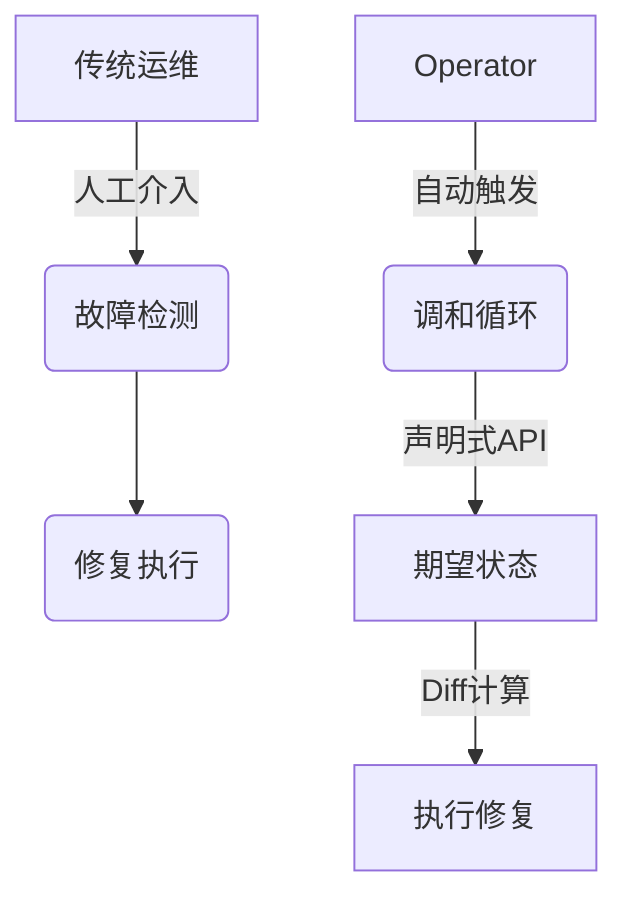
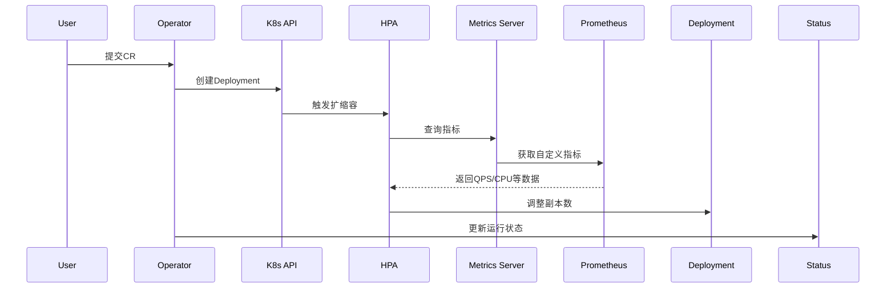

## 🌟 Operator模式在Serverless场景中的意义
> [!tip] 云原生时代的自动化治理  
> 在Serverless架构中，Operator通过以下机制实现"零运维"理想：  
> - **实时状态感知**：通过Kubernetes Watch机制捕获资源变更  
> - **智能修复闭环**：基于调和循环(Reconcile Loop)的自愈体系  
> - **弹性策略执行**：结合HPA/VPA实现自动扩缩容

### 架构优势对比


---

## 🛠️ 构建Memcached Operator

### 1. 项目初始化（Serverless优化技巧）
```bash
kubebuilder init \
  --domain=serverless.xyz \
  --repo=github.com/lazybearlee/memcached-operator
```

> [!NOTE]- 重要决策点：GOPATH vs Go Modules  
> 在Serverless CI/CD环境中推荐：  
> - 使用Go Modules管理依赖  
> - 设置`--repo`参数明确模块路径  
> - 禁用vendor目录（通过`go mod tidy`管理）

---

### 2. CRD设计哲学
```go
// MemcachedSpec 体现Serverless资源模型特点
type MemcachedSpec struct {
    // +kubebuilder:validation:Minimum=0  // 允许缩容到零
    // +kubebuilder:validation:Maximum=100
    Size int32 `json:"size"`

    // Serverless扩展字段
    ScalingWindow string `json:"scalingWindow,omitempty"`  // 扩缩容时间窗
    ColdStartBuffer int32 `json:"coldStartBuffer,omitempty"` // 预启动实例数
}
```

#### 状态设计模式
```go
type MemcachedStatus struct {
    Phase ConditionType `json:"phase"`  // Running/Scaling/Error
    LastScaleTime metav1.Time `json:"lastScaleTime"`
    ActiveConnections int32 `json:"activeConnections"` // 连接数指标
}
```

---

### 3. 调和逻辑的Serverless优化
```go
func (r *MemcachedReconciler) Reconcile(ctx context.Context, req ctrl.Request) (ctrl.Result, error) {
    // 获取当前指标数据
    metrics := GetPrometheusMetrics(req.NamespacedName)
    
    // 智能扩缩容决策
    desiredSize := CalculateDesiredSize(metrics)
    
    // 执行弹性伸缩
    if currentSize != desiredSize {
        UpdateDeploymentSize(desiredSize)
        return ctrl.Result{RequeueAfter: 30*time.Second}, nil
    }
    
    // 冷启动优化
    if ShouldPreWarm(metrics) {
        StartPreWarmInstances(c.Spec.ColdStartBuffer)
    }
    
    return ctrl.Result{}, nil
}
```

> [!warning] 性能关键点  
> 1. 使用指数退避策略避免调和风暴  
> 2. 通过Finalizers实现优雅终止  
> 3. 配合Knative Serving实现按需扩容

---

## 🔍 深度观察：Operator与Serverless架构的协同

### 架构融合模式


### 关键优化策略
1. **冷启动加速**  
   - 通过Init Containers预加载依赖  
   - 使用eBPF进行流量预测
   
2. **事件驱动架构**  
   ```go
   // 注册Knative事件触发器
   func SetupWebhook() {
       webhook.Register("/scale-event", HandleScaleEvent)
   }
   ```
   
3. **资源利用率提升**  
   - 采用共享Sidecar模式  
   - 实现基于Request的调度策略

---

## 🚀 KServe集成案例

### 模型服务Operator设计
```yaml
apiVersion: serving.kserve.io/v1beta1
kind: InferenceService
metadata:
  name: torch-mnist
spec:
  predictor:
    pytorch:
      storageUri: s3://models/mnist
      resources:
        limits:
          cpu: "2"
          nvidia.com/gpu: "1"
```

### 关键扩展点
1. **自动模型预热**  
   ```go
   func PreloadModel() {
       // 从对象存储下载模型
       DownloadFromS3(modelPath)
       // 加载到GPU显存
       LoadToGPU()
   }
   ```
   
2. **流量染色路由**  
   ```go
   func UpdateVirtualService(canaryPercent int) {
       // 更新Istio VirtualService
       PatchVirtualService("canary", canaryPercent)
   }
   ```

---

## 📚 推荐学习路径
```dataview
TABLE difficulty, focus_area
FROM "Kubebuilder学习资源"
WHERE status != "completed"
SORT difficulty ASC
```

---
