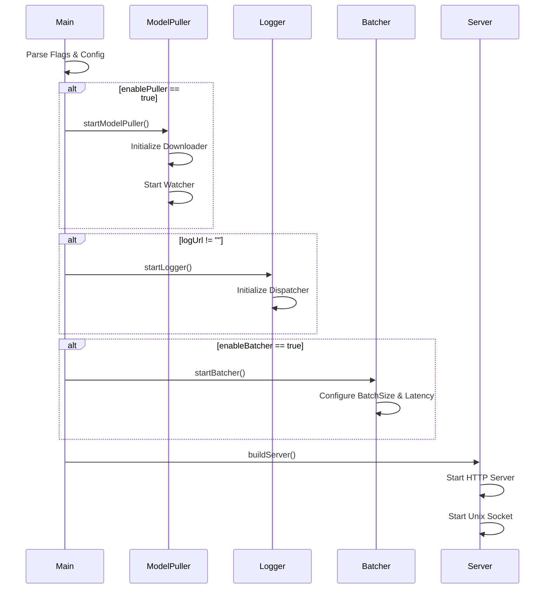
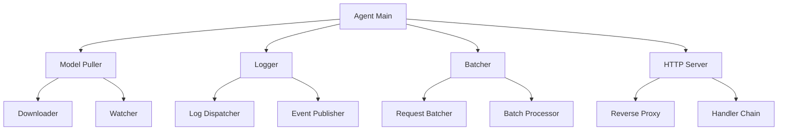
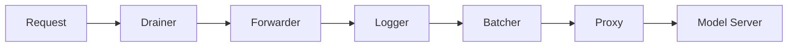

## 关键逻辑与流程图表

### 1. 启动流程

```mermaid
sequenceDiagram
    participant M as Main
    participant MP as ModelPuller
    participant L as Logger
    participant B as Batcher
    participant S as Server

    M->>M: Parse Flags & Config
    
    alt enablePuller == true
        M->>MP: startModelPuller()
        MP->>MP: Initialize Downloader
        MP->>MP: Start Watcher
    end
    
    alt logUrl != ""
        M->>L: startLogger()
        L->>L: Initialize Dispatcher
    end
    
    alt enableBatcher == true
        M->>B: startBatcher()
        B->>B: Configure BatchSize & Latency
    end
    
    M->>S: buildServer()
    S->>S: Start HTTP Server
    S->>S: Start Unix Socket
```

### 2. 组件结构

```mermaid
graph TD
    A[Agent Main] --> B[Model Puller]
    A --> C[Logger]
    A --> D[Batcher]
    A --> E[HTTP Server]
    
    B --> B1[Downloader]
    B --> B2[Watcher]
    
    C --> C1[Log Dispatcher]
    C --> C2[Event Publisher]
    
    D --> D1[Request Batcher]
    D --> D2[Batch Processor]
    
    E --> E1[Reverse Proxy]
    E --> E2[Handler Chain]
```

### 3. Handler 链路处理流程

```mermaid
flowchart LR
    A[Request] --> B[Drainer]
    B --> C[Forwarder]
    C --> D[Logger]
    D --> E[Batcher]
    E --> F[Proxy]
    F --> G[Model Server]
```

