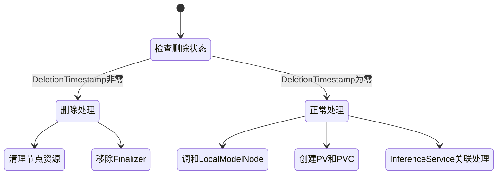
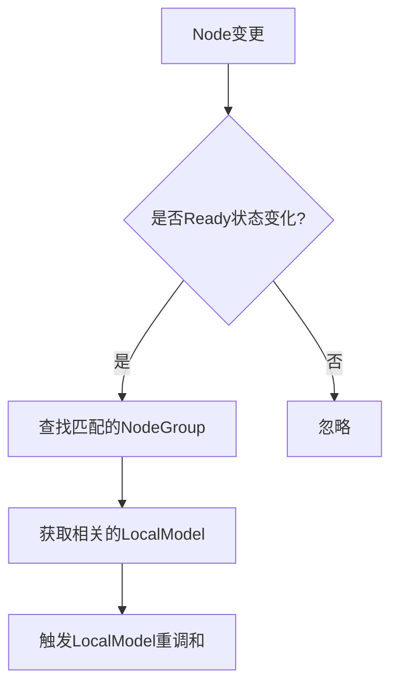
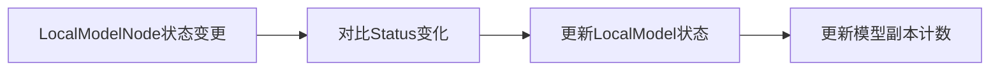
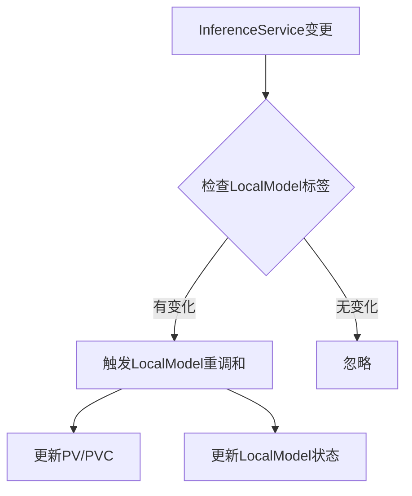
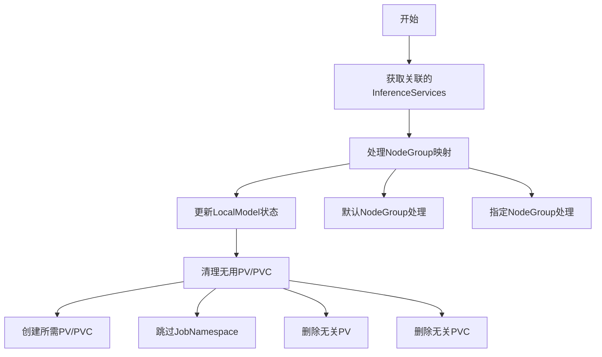

## LocalModel监听了哪些资源？

### 1. 资源监听配置

关键代码位于 SetupWithManager 方法中：

```go
controllerBuilder := ctrl.NewControllerManagedBy(mgr).
    For(&v1alpha1.LocalModelCache{}).          // 主资源
    // 从属资源
    Owns(&corev1.PersistentVolume{}).         // 监听 PV
    Owns(&corev1.PersistentVolumeClaim{})     // 监听 PVC
```

### 2. 条件监听资源

```go
if !localModelConfig.DisableVolumeManagement {
    controllerBuilder.Watches(
        &v1beta1.InferenceService{},          // 监听 InferenceService
        handler.EnqueueRequestsFromMapFunc(c.isvcFunc), 
        builder.WithPredicates(isvcPredicates)
    )
}

return controllerBuilder.
    // 监听节点变更
    Watches(&corev1.Node{}, 
        handler.EnqueueRequestsFromMapFunc(c.nodeFunc), 
        builder.WithPredicates(nodePredicates)).
    // 监听 LocalModelNode 状态变更
    Watches(&v1alpha1.LocalModelNode{}, 
        handler.EnqueueRequestsFromMapFunc(c.localmodelNodeFunc), 
        builder.WithPredicates(localModelNodePredicates))
```

### 3. 监听事件过滤器

```go
// InferenceService 事件过滤
isvcPredicates := predicate.Funcs{
    UpdateFunc: func(e event.UpdateEvent) bool {
        // 只在 LocalModel 标签变更时触发
        return e.ObjectOld.GetLabels()[constants.LocalModelLabel] != 
               e.ObjectNew.GetLabels()[constants.LocalModelLabel]
    },
    CreateFunc: func(e event.CreateEvent) bool {
        // 只监听带有 LocalModel 标签的创建
        _, ok := e.Object.GetLabels()[constants.LocalModelLabel]
        return ok
    },
    DeleteFunc: func(e event.DeleteEvent) bool {
        // 只监听带有 LocalModel 标签的删除
        _, ok := e.Object.GetLabels()[constants.LocalModelLabel]
        return ok
    },
}

// Node 事件过滤
nodePredicates := predicate.Funcs{
    UpdateFunc: func(e event.UpdateEvent) bool {
        // 只在节点从 NotReady 变为 Ready 时触发
        oldNode := e.ObjectNew.(*corev1.Node)
        newNode := e.ObjectNew.(*corev1.Node)
        return !isNodeReady(*oldNode) && isNodeReady(*newNode)
    },
}

// LocalModelNode 事件过滤
localModelNodePredicates := predicate.Funcs{
    UpdateFunc: func(e event.UpdateEvent) bool {
        // 只在状态发生变化时触发
        oldNode := e.ObjectOld.(*v1alpha1.LocalModelNode)
        newNode := e.ObjectNew.(*v1alpha1.LocalModelNode)
        return !reflect.DeepEqual(oldNode.Status, newNode.Status)
    },
}
```

### 4. 资源索引设置

```go
// 为 PVC 创建索引
if err := mgr.GetFieldIndexer().IndexField(context.Background(), 
    &corev1.PersistentVolumeClaim{}, 
    ownerKey, 
    func(rawObj client.Object) []string {
        // 索引 Owner 引用
    }); err != nil {
    return err
}

// 为 InferenceService 创建索引
if err := mgr.GetFieldIndexer().IndexField(context.Background(), 
    &v1beta1.InferenceService{}, 
    localModelKey, 
    func(rawObj client.Object) []string {
        // 索引 LocalModel 标签
    }); err != nil {
    return err
}
```

总结：
1. **主要监听资源**：
   - LocalModelCache (主资源)
   - PersistentVolume (拥有资源)
   - PersistentVolumeClaim (拥有资源)
   - InferenceService (条件监听)
   - Node (状态监听)
   - LocalModelNode (状态监听)

2. **监听触发条件**：
   - InferenceService: LocalModel 标签变更
   - Node: Ready 状态变更
   - LocalModelNode: 状态变更

3. **索引优化**：
   - PVC 所有者索引
   - InferenceService LocalModel 标签索引

## 处理流程

### 1. 全景扫描阶段

**核心使命**:
1. 管理模型在节点上的本地缓存，提升模型加载效率
2. 实现模型数据在指定节点组间的同步与分发
3. 协调模型存储资源(PV/PVC)的生命周期管理

**模块拓扑关系**:
```ascii
                    ┌─────────────────┐
                    │  InferenceService│
                    └────────┬────────┘
                             │
                    ┌────────▼────────┐
                    │   LocalModel    │
                    │   Controller    │
                    └────┬─────┬─────┘
              ┌─────────┘     └──────────┐
    ┌─────────▼─────────┐  ┌────────────▼──────────┐
    │  LocalModelNode   │  │ NodeGroup Controller  │
    └─────────┬─────────┘  └────────────┬──────────┘
              │                         │
    ┌─────────▼─────────┐    ┌─────────▼──────────┐
    │   Model Cache     │    │    PV/PVC Manager  │
    └─────────┬─────────┘    └────────────────────┘
              │
    ┌─────────▼─────────┐
    │  Storage Backend  │
    └─────────────────┘
```

**生态位**:
就像 Redis 在分布式系统中作为缓存层，LocalModel 在 KServe 中扮演着模型数据的分布式缓存管理器角色。

### 2. 核心逻辑解构

#### ▌第一层：接口契约

**关键 API**:
```go
// 控制器模式
type LocalModelReconciler struct {
    client.Client
    Clientset *kubernetes.Clientset
    Log       logr.Logger
    Scheme    *runtime.Scheme
}

// 主要接口
func (c *LocalModelReconciler) Reconcile(ctx context.Context, req ctrl.Request)
func (c *LocalModelReconciler) ReconcileLocalModelNode(ctx context.Context, localModel *v1alpha1.LocalModelCache, nodeGroups map[string]*v1alpha1.LocalModelNodeGroup)
```

敏感配置项:
- <!!> `localModelConfig.DisableVolumeManagement`
- <!!> `nodeGroup.Spec.PersistentVolumeSpec`

#### ▌第二层：控制流解剖

**执行时序**:

```mermaid
sequenceDiagram
    Controller->>LocalModel: 1. 获取配置和模型定义
    LocalModel->>NodeGroup: 2. 解析节点组配置
    NodeGroup->>Nodes: 3. 筛选符合条件的节点
    LocalModel->>Storage: 4. 创建存储资源
    Storage->>Nodes: 5. 分发模型数据
    Nodes-->>Controller: 6. 更新状态
```


**关键算法步骤**:
1. 节点筛选 ⚠️优化点：支持节点优先级
2. 模型分发 ⚠️优化点：增加并行下载
3. 状态同步 ⚠️优化点：引入事件驱动

**异常处理**:
- 重试机制：exponential backoff
- 节点失联：标记为 NotReady
- 存储错误：保持幂等性

#### ▌第三层：数据生命轨迹

**状态变化**:
```
ModelDownloadPending -> ModelDownloading -> ModelDownloaded/ModelDownloadError
```

**持久化机制**:
- 模型数据：PV/PVC (路径: /mnt/models)
- 元数据：etcd (通过 K8s API)

## 调和逻辑

### 1. LocalModelCache 资源变更



核心处理代码：
```go
func (c *LocalModelReconciler) Reconcile(ctx context.Context, req ctrl.Request) (ctrl.Result, error) {
    // 1. 删除处理
    if !localModel.ObjectMeta.DeletionTimestamp.IsZero() {
        return c.deleteModelFromNodes(ctx, localModel, nodeGroups)
    }
    
    // 2. 正常处理
    // 2.1 调和 LocalModelNode
    c.ReconcileLocalModelNode(ctx, localModel, nodeGroups)
    // 2.2 创建存储资源
    c.createPV(ctx, pv, localModel)
    c.createPVC(ctx, pvc, namespace, localModel)
    // 2.3 处理 InferenceService 关联
    c.ReconcileForIsvcs(ctx, localModel, nodeGroups, defaultNodeGroup, jobNamespace)
}
```
### 2. Node 资源变更



关键代码：
```go
nodePredicates := predicate.Funcs{
    UpdateFunc: func(e event.UpdateEvent) bool {
        // 只在节点从 NotReady 变为 Ready 时触发
        oldNode := e.ObjectNew.(*corev1.Node)
        newNode := e.ObjectNew.(*corev1.Node)
        return !isNodeReady(*oldNode) && isNodeReady(*newNode)
    }
}

func (c *LocalModelReconciler) nodeFunc(ctx context.Context, obj client.Object) []reconcile.Request {
    node := obj.(*corev1.Node)
    // 1. 获取所有 LocalModel
    // 2. 检查节点是否匹配 NodeGroup
    // 3. 触发相关 LocalModel 的重调和
}
```

### 3. LocalModelNode 状态变更



处理逻辑：
```go
localModelNodePredicates := predicate.Funcs{
    UpdateFunc: func(e event.UpdateEvent) bool {
        // 只在状态发生变化时触发
        oldNode := e.ObjectOld.(*v1alpha1.LocalModelNode)
        newNode := e.ObjectNew.(*v1alpha1.LocalModelNode)
        return !reflect.DeepEqual(oldNode.Status, newNode.Status)
    }
}

func (c *LocalModelReconciler) ReconcileLocalModelNode(ctx context.Context, localModel *v1alpha1.LocalModelCache, nodeGroups map[string]*v1alpha1.LocalModelNodeGroup) error {
    // 1. 更新节点状态
    modelStatus := localModelNode.Status.ModelStatus[localModel.Name]
    localModel.Status.NodeStatus[node.Name] = nodeStatusFromLocalModelStatus(modelStatus)
    
    // 2. 更新副本计数
    localModel.Status.ModelCopies = &v1alpha1.ModelCopies{
        Total: len(localModel.Status.NodeStatus),
        Available: successfulNodes,
        Failed: failedNodes,
    }
}
```

### 4. InferenceService 变更



处理代码：
```go
isvcPredicates := predicate.Funcs{
    UpdateFunc: func(e event.UpdateEvent) bool {
        // 只在 LocalModel 标签发生变化时触发
        return e.ObjectOld.GetLabels()[constants.LocalModelLabel] != 
               e.ObjectNew.GetLabels()[constants.LocalModelLabel]
    }
}

func (c *LocalModelReconciler) ReconcileForIsvcs(ctx context.Context, localModel *v1alpha1.LocalModelCache,
    localModelNodeGroups map[string]*v1alpha1.LocalModelNodeGroup, defaultNodeGroup *v1alpha1.LocalModelNodeGroup, jobNamespace string) error {
    // 1. 获取关联的 InferenceServices
    // 2. 更新存储资源
    // 3. 清理不需要的 PV/PVC
    // 4. 更新 LocalModel 状态
}
```
而在调和ISVC时，`ReconcileForIsvcs` 主要负责管理 InferenceService 相关的存储资源（PV/PVC），具体包括：
1. 查找使用本地模型的 InferenceService
2. 为每个命名空间创建所需的存储资源
3. 清理不再需要的存储资源

- 详细流程



```go
func (c *LocalModelReconciler) ReconcileForIsvcs(ctx context.Context, localModel *v1alpha1.LocalModelCache,
    localModelNodeGroups map[string]*v1alpha1.LocalModelNodeGroup, 
    defaultNodeGroup *v1alpha1.LocalModelNodeGroup, 
    jobNamespace string) error {
    
    // 1. 获取所有使用此模型的 InferenceService
    isvcs := &v1beta1.InferenceServiceList{}
    if err := c.Client.List(ctx, isvcs, client.MatchingFields{localModelKey: localModel.Name}); err != nil {
        return err
    }

    // 2. 构建命名空间到节点组的映射
    namespaceToNodeGroups := make(map[string]map[string]*v1alpha1.LocalModelNodeGroup)
    for _, isvc := range isvcs.Items {
        // 处理指定了 NodeGroup 的情况
        if isvcNodeGroup, ok := isvc.ObjectMeta.Annotations[constants.NodeGroupAnnotationKey]; ok {
            if nodeGroup, ok := localModelNodeGroups[isvcNodeGroup]; ok {
                namespaceToNodeGroups[isvc.Namespace][nodeGroup.Name] = nodeGroup
            }
        } else {
            // 使用默认 NodeGroup
            namespaceToNodeGroups[isvc.Namespace] = map[string]*v1alpha1.LocalModelNodeGroup{
                defaultNodeGroup.Name: defaultNodeGroup,
            }
        }
    }

    // 3. 清理不再需要的 PV/PVC
    pvcs := corev1.PersistentVolumeClaimList{}
    if err := c.List(ctx, &pvcs, client.MatchingFields{ownerKey: localModel.Name}); err != nil {
        return err
    }
    
    for _, pvc := range pvcs.Items {
        if _, ok := namespaceToNodeGroups[pvc.Namespace]; !ok {
            if pvc.Namespace == jobNamespace {
                continue  // 保留 jobNamespace 中的 PVC
            }
            // 删除不需要的 PVC 和对应的 PV
            c.deleteStorageResources(ctx, pvc)
        }
    }

    // 4. 为每个命名空间创建所需的存储资源
    for namespace, nodeGroups := range namespaceToNodeGroups {
        for nodeGroupName, nodeGroup := range nodeGroups {
            // 创建 PV
            pv := createPVSpec(localModel, nodeGroup, namespace, nodeGroupName)
            if err := c.createPV(ctx, pv, localModel); err != nil {
                c.Log.Error(err, "Create PV error")
            }

            // 创建 PVC
            pvc := createPVCSpec(localModel, nodeGroup, nodeGroupName)
            pvc.Spec.VolumeName = pv.Name
            if err := c.createPVC(ctx, pvc, namespace, localModel); err != nil {
                c.Log.Error(err, "Create PVC error")
            }
        }
    }
```

1. **命名空间隔离**:
	   - 每个命名空间独立的存储资源
	   - 支持跨命名空间模型共享
2. **NodeGroup 处理**:
   ```go
   if isvcNodeGroup, ok := isvc.ObjectMeta.Annotations[constants.NodeGroupAnnotationKey]; ok {
       // 使用指定的 NodeGroup
   } else {
       // 使用默认 NodeGroup
   }
   ```
3. **资源清理机制**:
   ```go
   // 保护性清理
   if pvc.Namespace == jobNamespace {
       // 保留下载任务使用的存储
       continue
   }
   ```
4. **状态同步**:
   ```go
   localModel.Status.InferenceServices = isvcNames
   if err := c.Status().Update(ctx, localModel); err != nil {
       c.Log.Error(err, "cannot update status")
   }
   ```

1. **存储资源命名**:
	   - PV: `{pvcName}-{namespace}`
	   - PVC: `{modelName}-{nodeGroupName}`
2. **所有权控制**:
	   - 使用 `ownerReference` 管理资源生命周期
	   - 自动清理孤立资源
3. **错误处理**:
	   - 资源创建失败时继续处理其他资源
	   - 记录错误但不中断整体流程
4. **配置依赖**:
   ```go
   // PV 规格来自 NodeGroup 配置
   pv.Spec = nodeGroup.Spec.PersistentVolumeSpec
   // PVC 规格来自 NodeGroup 配置
   pvc.Spec = nodeGroup.Spec.PersistentVolumeClaimSpec
   ```

### 设计思路

1. **分层处理**：
	   - 资源状态变更检测（Predicates）
	   - 变更事件过滤（Watches）
	   - 具体处理逻辑（Reconcile）
2. **状态同步**：
	   - Node → LocalModelNode → LocalModel
	   - InferenceService → LocalModel → PV/PVC
3. **资源生命周期**：
	   - 创建：添加 Finalizer
	   - 更新：状态同步
	   - 删除：清理关联资源
4. **容错处理**：
	   - 资源不存在：创建新资源
	   - 状态不一致：触发重调和
	   - 删除失败：重试机制

### 3. 二次开发沙盘

[假设场景]如果要实现模型预热功能：

**需要修改**:
```go
// pkg/controller/v1alpha1/localmodel/controller.go
func (c *LocalModelReconciler) ReconcileLocalModelNode() {
    // 添加预热逻辑
}
```

**影响评估**:
- InferenceService: 中等概率影响
- 存储系统：高概率影响
- 性能监控：低概率影响

【我的批注】
LocalModel 的设计体现了 KServe 对模型部署效率的考虑，通过本地缓存和预热机制提升了服务质量。核心在于解决"模型数据分发"这一分布式系统典型问题。
