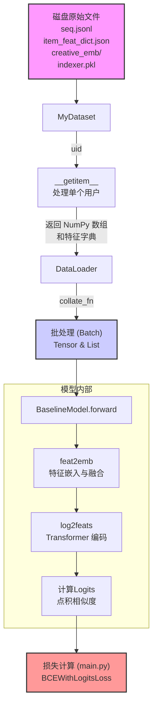

### 数据流向与变换深度分析

整个系统的数据流动可以分为两个核心阶段：

1.  **阶段一：数据加载与批处理（`dataset.py`）**：此阶段负责从磁盘读取原始数据，为每个用户构建训练样本，并最终聚合成可供模型消费的批处理（Batch）数据。
2.  **阶段二：模型计算与前向传播（`model.py`）**：此阶段接收批处理数据，在模型内部进行一系列复杂的特征嵌入、融合与序列编码，最终计算出用于训练的`logits`。

---

### 高层数据流向图

为了更直观地理解，我们可以将整个流程看作一个管道：

---

### 阶段一：数据加载与批处理 (`dataset.py`)

此阶段的核心是 `MyDataset` 类，它定义了数据如何从原始形态一步步转变为结构化的训练样本。

#### 1. 数据源 (Data Source)

-   **原始形态**: 多个独立文件，存储在磁盘上。
    -   `seq.jsonl`: **(核心)** 每行是一个用户的完整行为序列（JSON格式）。
    -   `item_feat_dict.json`: 物品的特征字典，`key`是物品ID，`value`是特征。
    -   `indexer.pkl`: 包含用户、物品、特征ID与其内部索引（整数ID）的映射关系。
    -   `creative_emb/`: 存储预训练的多模态特征向量（`*.pkl`, `*.json`）。
    -   `seq_offsets.pkl`: **(性能优化点)** 存储`seq.jsonl`中每一行的文件偏移量，实现O(1)复杂度的用户数据随机访问。

#### 2. 单样本处理 (`__getitem__`)

这是数据第一次发生显著形态变换的地方。当`DataLoader`请求一个用户数据时，`__getitem__(uid)`被调用。

-   **输入**: 用户索引 `uid` (一个整数)。
-   **处理流程与数据变换**:
    1.  **读取**: 使用 `_load_user_data(uid)`，通过文件偏移量快速从 `seq.jsonl` 读取该用户的JSON行，并解析为Python的`list of tuples`。
        -   **数据形态**: `JSON String` -> `List[Tuple]`，例如 `[(u, i, u_feat, i_feat, ...), ...]`。
    2.  **序列重组**: 代码将用户画像（`user_feat`不为`None`的记录）和物品交互（`item_feat`不为`None`的记录）分开，并将用户画像记录插入到序列开头。
        -   **数据形态**: `List[Tuple]` -> `ext_user_sequence` (一个重新排序的`List[Tuple]`)。
    3.  **样本构建 (核心)**:
        -   采用**滑动窗口**和**Left-Padding**策略，从后向前遍历 `ext_user_sequence`。
        -   在每个时间步 `idx`，它会构建 `(上下文, 预测目标)` 对。
        -   `seq[idx]`: 上下文中的当前token (user或item) ID。
        -   `pos[idx]`: 真实的下一个交互物品ID (正样本)。
        -   `neg[idx]`: 通过 `_random_neq` 随机采样的、用户未交互过的物品ID (负样本)。
        -   `token_type[idx]`, `next_token_type[idx]`, `next_action_type[idx]` 分别记录当前、下一个token的类型和动作。
        -   `seq_feat[idx]`, `pos_feat[idx]`, `neg_feat[idx]`: 对应的特征字典。通过 `fill_missing_feat` 补全所有预定义的特征字段。
    4.  **最终输出 (单样本)**:
        -   **数据形态**: 返回9个**NumPy数组**。其中前6个是整数ID数组 (`np.int32`)，后3个是对象数组 (`dtype=object`)，因为它们存储的是Python字典。
        -   **形状**: 所有数组的形状都是 `[maxlen + 1]`。

#### 3. 批处理聚合 (`collate_fn`)

`DataLoader` 在收集到 `batch_size` 个由 `__getitem__` 生成的样本后，会调用 `collate_fn` 将它们打包。

-   **输入**: `List[Tuple]`，列表长度为 `batch_size`，元组是 `__getitem__` 返回的9个NumPy数组。
-   **处理流程与数据变换**:
    1.  **聚合**: 使用 `zip(*batch)` 将样本数据按类型解包。
    2.  **变换**:
        -   对于ID类数据（`seq`, `pos`, `neg`等），通过 `np.array()` 堆叠成一个大的NumPy数组，然后用 `torch.from_numpy()` 转换为PyTorch Tensor。
            -   **数据形态**: `List[np.ndarray]` (shape: `[maxlen+1]`) -> `torch.Tensor` (shape: `[batch_size, maxlen+1]`)。
        -   对于特征数据（`seq_feat`, `pos_feat`, `neg_feat`），它们被保留为Python的`list`。
            -   **数据形态**: `Tuple[np.ndarray(dtype=object), ...]` (length: `batch_size`) -> `List[np.ndarray(dtype=object)]` (length: `batch_size`)。

**阶段一总结**：数据从分散的磁盘文件，经过单样本构建（NumPy化），最终被聚合为模型可以直接消费的、由**PyTorch Tensors**和**Python Lists**组成的批处理数据。

---

### 阶段二：模型计算与前向传播 (`model.py`)

数据进入 `BaselineModel` 后，将经历一系列更高维度的变换，从ID和原始特征变为语义丰富的向量表示。

#### 1. 特征到嵌入 (`feat2emb`)

这是模型内部数据变换的第一站，也是最复杂的一站。它的目标是将输入的ID和特征字典统一转换为 `(batch_size, seq_len, hidden_units)` 形状的嵌入向量。

-   **输入**:
    -   ID序列Tensor: `seq` (shape: `[batch_size, seq_len]`)。
    -   特征字典List: `feature_array` (一个嵌套的列表/数组，结构复杂)。
-   **处理流程与数据变换**:
    1.  **特征张量化 (`feat2tensor`)**: 这是关键一步。它遍历每种特征（如 `'103'`, `'106'`），将 `feature_array` (List of Dicts) 中对应的值提取出来，并转换成一个单一的、补齐的PyTorch Tensor。
        -   **稀疏特征**: `List[Dict]` -> `Tensor[batch_size, seq_len]`
        -   **数组特征**: `List[Dict]` -> `Tensor[batch_size, seq_len, max_array_len]` (进行了二级Padding)
    2.  **嵌入查找**:
        -   **ID/稀疏/数组特征**: 使用 `torch.nn.Embedding` 层将整数ID Tensor转换为稠密向量。数组特征的嵌入会进行 `sum(dim=2)` 操作。
        -   **多模态特征**: 原始的 `(N, D_raw)` 浮点数向量通过 `torch.nn.Linear` 变换到 `(N, hidden_units)`。
        -   **连续特征**: 直接使用，并在最后增加一个维度以对齐。
    3.  **特征融合**:
        -   所有`item`相关的特征向量在 `dim=2` 上被 `torch.cat` 拼接起来。
        -   所有`user`相关的特征向量也被拼接起来。
        -   拼接后的大向量分别通过一个DNN（`self.itemdnn`, `self.userdnn`）进行降维和信息融合。
        -   最终，用户和物品的嵌入向量通过**相加**进行融合。
-   **输出**: `seqs_emb`，一个 `torch.Tensor`。
    -   **数据形态**: `(Tensor, List[Dict])` -> `Tensor[batch_size, seq_len, hidden_units]`。

#### 2. Transformer序列编码 (`log2feats`)

接收 `feat2emb` 的输出，通过Transformer架构进行上下文感知的信息编码。

-   **输入**: `seqs_emb` (shape: `[batch_size, seq_len, hidden_units]`)。
-   **处理流程与数据变换**:
    1.  **缩放与位置编码**: 嵌入向量乘以 `sqrt(embedding_dim)` 进行缩放，然后加上可学习的位置编码 `self.pos_emb`。
        -   **数据形态**: 值的改变，形状 `[batch_size, seq_len, hidden_units]` 不变。
    2.  **Transformer层**: 数据依次通过多个Transformer Block（多头注意力 -> Add & Norm -> Feed Forward -> Add & Norm）。在每个Block中，序列中每个位置的向量都会根据序列中其他位置的信息进行更新。
        -   **数据形态**: 值的持续精炼，形状 `[batch_size, seq_len, hidden_units]` 保持不变。
-   **输出**: `log_feats`，最终的上下文感知序列表示。
    -   **数据形态**: `Tensor[batch_size, seq_len, hidden_units]`。

#### 3. Logits计算与输出 (`forward`)

这是模型计算的最后一步。

-   **输入**:
    -   `log_feats`: 上下文序列表示。
    -   `pos_seqs`, `neg_seqs` 和它们的特征。
-   **处理流程与数据变换**:
    1.  **正负样本嵌入**: `pos_seqs` 和 `neg_seqs` 再次通过 `feat2emb`（`include_user=False`）被转换成嵌入向量 `pos_embs` 和 `neg_embs`。
    2.  **相似度计算**: 通过**逐元素乘法后求和**（等价于点积）计算 `log_feats` 与 `pos_embs` 和 `neg_embs` 的相似度。
        -   `pos_logits = (log_feats * pos_embs).sum(dim=-1)`
-   **输出**:
    -   **数据形态**: `Tensor[batch_size, seq_len, hidden_units]` -> `Tuple[Tensor, Tensor]`
    -   **形状**: `(pos_logits, neg_logits)`，每个Tensor的形状都是 `[batch_size, seq_len]`。

#### 4. 损失计算 (`main.py`)

-   **输入**: `pos_logits`, `neg_logits`
-   **处理流程与数据变换**:
    1.  **标签创建**: 创建全1的`pos_labels`和全0的`neg_labels`。
    2.  **损失过滤**: 使用 `indices = np.where(next_token_type == 1)`，确保只对需要预测**物品**的位置计算损失。
    3.  **损失函数**: `BCEWithLogitsLoss` 计算logits和标签之间的二元交叉熵损失。
-   **最终输出**:
    -   **数据形态**: `Tensors` -> 一个标量 `torch.Tensor` (代表整个Batch的平均损失)。

**阶段二总结**: 数据从结构化的批处理（Tensors + Lists）进入模型，被逐步转换为高维、稠密的语义向量。通过特征融合和Transformer的自注意力机制，模型学习到序列的上下文表示，并最终通过与正负样本的对比计算出用于梯度下降的标量损失值。