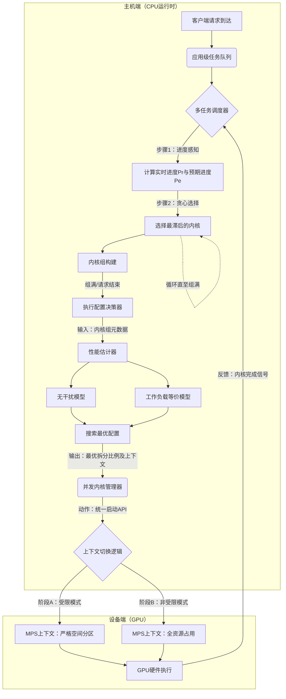

这是一篇来自上交、阿里和微软团队合作的论文，为系统设计与优化类论文。具体针对数据中心/云环境下的 GPU 资源调度与共享问题 。

主要的背景是现有的 GPU 共享机制主要分为“时间切片共享 (Temporal Sharing)”和“空间分区共享 (Spatial Sharing)”。前者导致延迟不可预测，后者导致资源利用率低（存在未使用的算力“气泡”）。

从实验上来看，论文基于 NVIDIA A100 GPU 进行了验证，使用了 VGG11、ResNet50、BERT 等经典模型，方法论和实验数据在逻辑上是比较自洽的（但是具体落到像transformer、dit这些更大的模型来说，还有待商榷）。

论文团队提出了一种名为 **BLESS** 的无气泡时空共享系统。核心创新在于引入“Kernel Squad”调度粒度，利用细粒度的资源重配置技术，在毫秒级填补 GPU 算力气泡，同时保证服务质量。

另外，什么是气泡？

GPU 的核心计算资源是**SM（流多处理器）**，空间共享（如 MPS）是**静态将 SM 划给不同应用**（比如给 VGG11 分 1/3 SM，ResNet50 分 2/3 SM）。

而**气泡**，就是 “静态分配给某应用的 SM 资源中，该应用当前计算负载没占满的部分”—— 因为空间共享的规则是 “分配给你的 SM 只能你用”，所以即使这部分 SM 闲在那，其他应用（哪怕负载很高）也碰不到，这部分 “已锁定但未使用的 SM 资源”，就是论文里的气泡。

像图里的空间共享（b）区域，那些条纹块对应的时间片，就是某应用分配到的 SM 没在干活的状态，这就是气泡的直观体现 —— 它直接拉低了 GPU 的整体资源利用率。

BLESS 的逻辑，就是在运行时实时检测这类闲置的 SM（气泡），临时把它们调度给需要的应用，等原应用需要时再收回，以此吃掉气泡、提效。

## 一些背景

在讲解 BLESS 的系统架构之前，先来铺垫一下一些背景，讲清楚“现在的 GPU 是怎么跑任务的”以及“现有的方法为什么不行”。

**Figure 2** 展示了一个标准的、多用户共享 GPU 的工作流。

以下是一些相关的概念：

- **App / DAG (有向无环图):** 左上角的 `DAG of App1` 就是应用本身（比如一个 ResNet50 推理请求）。它由一堆圆圈组成，每个圆圈代表一个 **Operator (算子)**，比如卷积（Conv）、矩阵乘法（MatMul）。
- **Kernel (核函数):** 这是 GPU 执行的**最小原子单位**。一个算子（Operator）通常对应一个或多个 **Kernel**。在调度视角下，不要把应用看作一大块铁板，要把它看作是一条由几十上百个 Kernel 组成的“指令流”。
- **Context (上下文) & Device Queues (设备队列):**
    - **Context**：是用户在 GPU 上的上下文，存放了显存数据、模型参数等。
    - **Device Queues (Stream)**：每个上下文都有自己的“传送带”（图中的圆环）。CPU 把要执行的 Kernel 放到传送带上，排队等待进入 GPU 核心。
- **Hardware Scheduler (硬件调度器):** 这是 GPU 内部的“工头”。它的工作非常机械：**从各个传送带（Queue）上抓取 Kernel，扔进计算单元（SMs）里执行**。这个调度器通常不知道哪个任务更重要，它只是尽力把所有空闲的计算单元填满。

**正常流程是怎样的？**
1. CPU 上的驱动程序把 App 的 Kernel 塞进 **Device Queue**。
2. GPU 的 **Hardware Scheduler** 看到 Queue 里有活了，就分派给 **SMs** 去跑。
3. 如果只有一个 App，那它就独占所有 SM。如果有多个 App，大家就抢 SM 资源。

我们来看fig3，它展示了当两个应用（Client 1 和 Client 2）同时抢 GPU 时，三种经典调度方式的一些问题。

**假设场景**
- **紫色任务 (Client 1)**：大任务，需要很多算力。
- **绿色任务 (Client 2)**：小任务，来得晚一点。
- **目标**：想让两个任务都跑得快，且互不干扰。
    
#### **方案 A：静态隔离 (Static Sharing) —— 对应 Figure 3(a)**

这个方案用 MPS 把 GPU 劈成两半，Client 1 只能用左边 50% SM，Client 2 只能用右边 50% SM。

问题在于 Client 1 的紫色方块被压扁了（因为只能用一半资源），执行时间变长。看图中间，当 Client 2 还没来，或者 Client 2 跑完了，Client 1 **依然不能使用** Client 2 闲置的那一半资源。

那些空白区域就是**气泡**。资源被锁死了，极其浪费。

#### **方案 B：无界共享 (Unbounded Sharing) —— 对应 Figure 3(b)**

不做任何限制，大家把 Kernel 扔进 GPU，让硬件调度器自己看着办。

 **紫色和绿色混在一起**。图中标注了 "Interfered kernel execution sequence"（受干扰的执行序列）。虽然没有明显的空白气泡（利用率高），但 Client 2（绿色）本来是个短任务，结果被迫和 Client 1 挤在一起，**延迟变得不可预测**。这就好比我们去便利店买瓶水，结果排队时前面的人在搞批发，我们得等很久。
 
这样的结果就是利用率高，但**延迟不可控**。

#### **方案 C：有偏共享 (Biased Sharing) —— 对应 Figure 3(c)**

这个方案使用了 VIP 通道。Client 2 来了，强行让 Client 1 暂停（Preemption）或者把 Client 1 的资源压到极低。

Client 2 爽了，以此为代价的是 Client 1 被严重拖慢。

而且，Kernel 的切换是有开销的，且很难做到完美衔接，图中依然出现了**气泡**。

#### 那么，怎么解决？

看懂了上面三个场景，我们就能理解 **Kernel Squad** 的精妙之处了。

BLESS 的思路是：**能不能结合 (a) 和 (b) 的优点？** 即：**平时像 (b) 一样全速跑（占满 GPU），一旦有人来抢资源，立刻像 (a) 一样乖乖缩回自己的地盘。**

要做到这一点，关键在于 **切换的速度**。

- **如果按 Request (整个请求) 为单位调度**：太慢了。一个请求可能要跑几十毫秒，等它跑完再调整资源，黄花菜都凉了。
- **如果按 Kernel (单个核函数) 为单位调度**：太碎了。一个 Kernel 可能只跑几微秒，CPU 每发一个 Kernel 都要去调整资源配置，调度开销比执行时间还长。

#### **Kernel Squad (核小队) 的定义**

**Kernel Squad 是一组“适量”的 Kernel 集合。** 它是一个中间粒度。BLESS 把一个长长的 Request 切成若干段，每一段就是一个 Squad（比如包含 5-10 个 Kernel，执行时间几毫秒）。

#### **Kernel Squad 是怎么被调度的？**

想象一下 BLESS 调度器在 CPU 上的操作逻辑：

1. **打包**： 调度器看到 App 1 和 App 2 的请求来了，它不一次性把所有 Kernel 发给 GPU。它先拿 App 1 的前 5 个 Kernel，和 App 2 的前 3 个 Kernel，打包成一个 **Squad 1**。
2. **决策**： 在发送这个 Squad 1 之前，BLESS 思考：**“这一小队 Kernel 应该怎么跑？”**
    - 如果是**静态隔离**（方案A），那 App 1 只能用 50% 资源。
    - 如果是**无界共享**（方案B），大家乱抢。
    - **BLESS 的策略**：它会预测，如果我让 App 1 先用 100% 资源跑前 2 个 Kernel，然后迅速缩回到 50% 让 App 2 进来，最后再放开……哪种组合最快？
3. **执行**： 决策完毕，BLESS 告诉 GPU：“按照这个资源配置，执行这一个小队。” **关键点**：当这个 Squad 执行完（仅几毫秒），BLESS 马上有机会进行**下一次决策**。

## 系统架构

BLESS 的本质是一个**用户态的中间件**。它位于应用程序（深度学习推理框架）与 GPU 驱动/硬件之间，接管了 Kernel 的提交与调度权。

它的核心设计是将粗粒度的“请求级”调度拆解为细粒度的“核小队级”调度，并通过离线剖析数据驱动在线决策。

如上面图 5 所示，BLESS 的架构主要包含两个阶段：**离线部署阶段 (Offline Deployment)** 和 **在线运行时阶段 (Online Runtime)**。

### **1. 离线部署阶段 (Offline Deployment)**

这是系统的“冷启动”环节，主要目的是建立性能模型，消除在线调度的不确定性。
- 应用注册与剖析:
    对于推理或训练任务，其计算图（DAG）一般来说是静态且可预测的。BLESS 预先运行应用，遍历不同的资源配置（例如分配 5%, 10%, ... 100% 的 SM 资源），记录每个 Kernel 在特定资源下的执行延迟（$t[n\%][k]$）。
- 上下文预热:
    BLESS 利用 NVIDIA MPS（Multi-Process Service）机制，预先为每个应用创建多个不同资源配额的 MPS Context 。这里的 Context 可以理解为预设了资源上限的“容器”。例如，为模型 A 预创建一个“限制为 20 SMs”的 Context 和一个“无限制”的 Context。运行时只需选择向哪个 Context 提交 Kernel，即可实现毫秒级的资源动态调整，避免了昂贵的 Context 创建开销。

### **2. 在线运行时阶段 (Online Runtime)**

这是 BLESS 的核心，包含三个流水线式的组件，它们并行运行于 Host 端（CPU），负责向 Device 端（GPU）输送指令。

#### **多任务调度器 (Multi-task Scheduler)**

**职责：逻辑编排与流量整形**

调度器维护每个应用的独立任务队列。它不直接调度整个推理请求，而是感知每个请求的**实时进度**。

- **进度感知：** 调度器计算请求的实际执行时间与目标隔离延迟（Isolated Latency, 即 SLA）的比率。落后的请求优先级更高。
- **核小队（Kernel Squad）生成：** 这是 BLESS 调度的基本单元。调度器从多个并发应用的请求中，截取一小段 Kernel 序列（例如 App A 的 3 个 Kernel + App B 的 2 个 Kernel）打包成一个 **Kernel Squad**。相比于由硬件调度器处理海量无序的 Stream，或者由 OS 处理粗粒度的进程，Kernel Squad 提供了一个中间粒度的“调度窗口”。在这个窗口内，Host 端可以精确控制并发行为。

#### **执行配置决策器 (Execution Configuration Determiner)**

**职责：最优化搜索**

一旦 Kernel Squad 生成，该组件需要决定**如何**在 GPU 上摆放这些 Kernel。它利用离线剖析数据和在线预测器来搜索最优配置。

- **配置空间：** 决策器需要在多种空间切分方案中选择。例如，是让 App A 和 App B 彻底空间隔离（无干扰但有气泡），还是允许它们部分重叠（填补气泡）。
- **性能预测：** 使用轻量级的预测算法（如干扰无关预测器或负载等效预测器）估算不同配置下的 Squad 执行时长，选择预期延迟最低的方案。这是一个实时的 Cost Model。它在微秒级时间内来权衡“资源隔离带来的稳定性”与“资源共享带来的利用率提升”。

#### **并发 Kernel 管理器 (Concurrent Kernel Manager)**

**职责：底层分发与同步**

这是与 CUDA Driver 交互的执行层。

- **动态分发：** 根据决策器选定的配置，管理器调用统一的 API（如 `LaunchKernel`），将 Kernel 路由到对应的 **MPS Context** 中。举个例子，如果决策器认为当前 App A 需要严格限制在 20 个 SM 上运行，管理器就会将 A 的 Kernel 发送到那个预先创建好的“20-SM-Context”队列中。
- **同步机制：** 管理器在 Squad 边界处进行同步，确保上一组 Squad 执行完毕后，下一组 Squad 才能根据新的资源配置开始执行。这实现了细粒度的资源重配置。

---

## 执行流程

---

### **进度感知与小队生成**

当多个应用的 Request 到达 Host 端时，它们首先被缓冲在各自独立的任务队列中。多任务调度器 (Multi-task Scheduler) 并非简单的轮询，而是基于**相对进度**进行调度。

#### **1. 进度量化 (Quantifying Progress)**

调度器需要决定谁更“急迫”。它通过对比**实时进度 ($P_r$)** 与 **预期进度 ($P_e$)** 来做出判断。

- **定义变量**：
    - $T[n\%]$：应用在分配 $n\%$ 算力下的目标隔离延迟（SLA）。
    - $t_e[n\%]$：当前请求已流逝的时间（Wall-clock time）。
    - $\tau[n\%][k]$：根据离线 Profiling，执行到第 $k$ 个 Kernel 时理应消耗的时间。
- **计算逻辑**：
    - **实时进度**：$P_r = t_e[n\%] / T[n\%]$，表示“时间已经过去了百分之多少”。
    - **预期进度**：$P_e = \tau[n\%][k] / T[n\%]$，表示“工作理应完成了百分之多少”。
    - **相对进度比**：$P = P_r / P_e$。如果 $P > 1$，说明当前请求落后于预期（Lagging），需要补偿 。

#### **2. 核小队组装**

调度器采用**贪心策略** 生成 Kernel Squad：
1. 遍历所有活跃请求，计算 $P$ 值。
2. 选择 $P$ 值最大的请求（最落后的请求），从中取出一个 Kernel 加入当前的 Squad。
3. 更新该请求的状态，重复上述步骤。
4. **终止条件**：Squad 中的 Kernel 数量达到预设阈值（例如 50 个）或请求队列为空。

> 这种逐 Kernel 的细粒度交错，使得 BLESS 能够在毫秒级的时间窗口内动态平衡不同应用的延迟，而非像传统时间片轮转那样在几十毫秒的尺度上进行粗暴切换。

---

### **执行配置寻优**

现在，调度器手中有一个待执行的 Kernel Squad（例如：$\{K_{App1}, K_{App2}, K_{App1}, ...\}$）。**执行配置决策器**需要回答一个问题：**“如何摆放这些 Kernel 才能使这组 Squad 的总执行时间（Makespan）最短？”**

#### **1. 配置空间

决策器在以下两种主要模式及其组合中搜索：
- **NSP (No Spatial Partitioning)**：所有 Kernel 提交到无限制的 Context，自由争抢资源（高利用率，高干扰）。
- **SP (Strict Spatial Partitioning)**：根据配额 $n\%$，将 Kernel 严格限制在部分 SM 上（无干扰，有气泡）。
- **Semi-SP (Semi-Spatial Partitioning)**：BLESS 的特有策略。Squad 的前 $c\%$ 部分严格隔离，后 $(1-c)\%$ 部分解除限制，利用气泡。

#### **2. 性能预测**

为了在运行时快速决策，BLESS 引入了两个轻量级预测器模型：
- 无干扰预测器 (Interference-free predictor)：适用于 SP 模式。假设资源严格隔离，Squad 的持续时间由耗时最长的应用决定
$$T_{squad} = \max_{j \in R} \left( \sum t[n\%][k] \right)$$
    其中 $R$ 是 Squad 中涉及的应用集合。
- 负载等效预测器 (Workload-equivalence predictor)：
    适用于 NSP 模式。假设所有 Kernel 会发生重叠，系统将其建模为等效的串行执行流，但每个 Kernel 的执行速度受限于全局负载。预测时间为所有 Kernel 在折算后的负载下执行时间的总和。

决策器计算不同配置下的预测时间，选择最小值作为该 Squad 的执行方案。

---

### **并发执行与资源重配置**

这是物理执行层。**并发 Kernel 管理器**根据决策器的输出，通过操作 **MPS Context** 来控制硬件行为。
#### **1. 上下文映射**

在离线阶段，BLESS 已经为每个应用创建了多个 Context（例如：Ctx_20SM，Ctx_Unbound）。
如果决策结果是 Semi-SP（例如前 50% Kernel 隔离，后 50% 不隔离），管理器会执行以下操作序列：
1. **Phase A (隔离阶段)**：调用 `LaunchKernel`，将前 50% 的 Kernel 注入到带有资源限制的 Context（如 `Ctx_20SM`）对应的 Device Queue 中。
2. **Barrier (同步屏障)**：在 Host 端设置同步点，等待 Phase A 的 Kernel 执行完毕。这是为了防止后序 Kernel 提前抢占资源导致隔离失效。
3. **Phase B (爆发阶段)**：将剩余 Kernel 注入到无限制的 Context（`Ctx_Unbound`），允许应用利用此时可能出现的任何空闲气泡。
#### **2. 物理执行**

GPU 的硬件调度器（Hardware Scheduler）从这些 Queue 中获取 Kernel 并分派给 SM。由于 Phase A 的 Context 带有 MPS 限制，硬件调度器会强制约束其 SM 占用率。而进入 Phase B 后，限制解除，Kernel 瞬间填满剩余算力。

---

所以，为什么 BLESS 的执行流程能够奏效？

回到 BLESS 的核心逻辑，这个流程通过两点消除了气泡：

1. **填补空隙**：在 **Phase B**，当原本受限的应用（如 App1）还有剩余任务，而 App2 已经做完或者处于低负载时，App1 能够瞬间通过 `Ctx_Unbound` 溢出到 App2 闲置的 SM 上，吃掉气泡。
2. **快速回撤**：一旦新的高优先级 Squad 到达，下一个 Squad 的执行会重新评估。如果 App2 变忙了，决策器会立即切换回 **SP 模式**，将 App1 赶回 `Ctx_20SM`，保证 App2 的 SLA。
