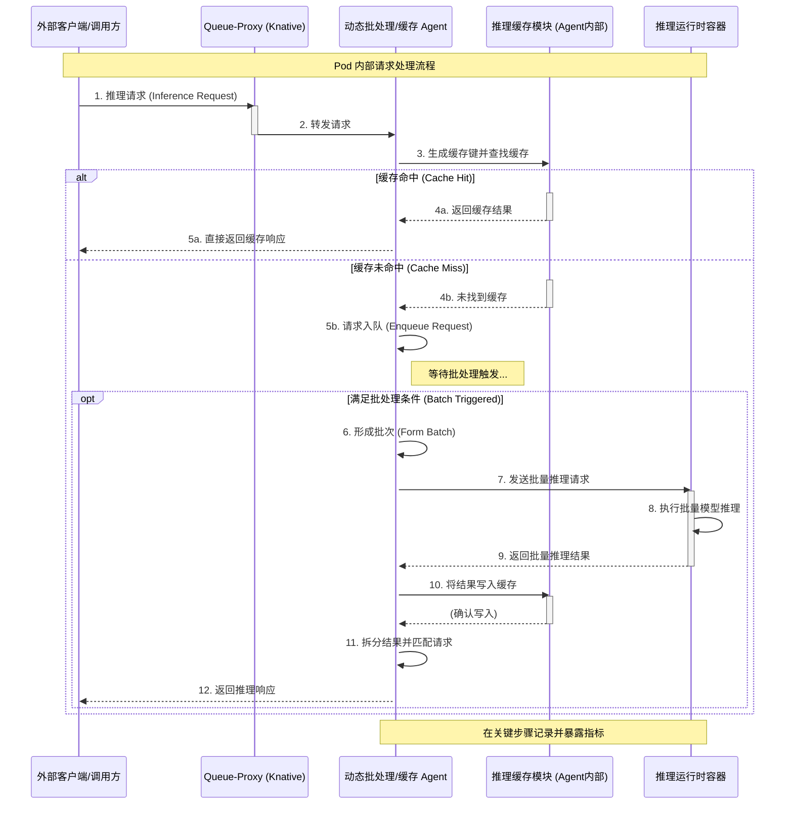

第三章：无服务器推理系统设计 - 写作思路

核心目标: 清晰、全面地阐述你所设计的无服务器推理系统的架构、核心组件及其交互方式，重点突出其设计思想、关键特性（包含动态批处理、缓存、可观测性）以及与现有技术（特别是 KServe 理念、Kubernetes、Knative）的关系。要让读者明白这个系统是如何组织的，为什么这样组织，以及它解决了什么问题。

写作结构建议 (尽可能详细):

3.1 引言 (Chapter Introduction)

目的: 简要说明本章的目标——详细阐述所设计的无服务器机器学习推理系统的架构与核心组件设计。

承上启下: 回顾第一章提出的研究目标和核心问题（构建一个集成了优化机制与可观测性的高质量系统），并连接第二章介绍的相关技术背景。

内容预告: 概述本章将要介绍的主要内容，例如总体架构、控制平面设计、数据平面设计（含优化模块）、可观测性子系统设计等。

3.2 设计目标与原则 (Design Goals and Principles)

目标重述: 再次明确系统设计的核心目标，例如：

提供一个易于使用、声明式的模型部署接口。

实现高效的资源利用率和优异的推理性能（低延迟、高吞吐量）。

内置 SLO 感知的动态性能优化能力。

具备全面的可观测性，易于监控、调试和管理。

具备良好的模块化和可扩展性。

设计原则阐述: 说明在设计过程中遵循的关键原则，例如：

云原生原则: 充分利用 Kubernetes 的能力（如 CRD, Controller, Operator 模式）。

Serverless 理念: 尽可能实现自动伸缩、按需使用（尽管你可能更关注 Pod 内部优化，但系统应基于 Serverless 基础）。

关注点分离 (Separation of Concerns): 例如，将批处理、缓存逻辑与核心推理逻辑解耦（通过 Agent 实现）。

声明式 API: 用户通过声明期望状态来管理服务。

可观测性优先 (Observability-first): 在设计之初就考虑如何监控和理解系统行为。

借鉴而非照搬: 说明如何在吸收 KServe 等先进框架设计精华的同时，进行自主设计和创新。

3.3 系统总体架构 (Overall System Architecture)

高层视图: 呈现系统的整体架构图（这是第一个关键图）。

组件划分: 明确划分系统的主要逻辑层面或子系统，通常包括：

控制平面 (Control Plane): 负责接收用户定义、管理资源生命周期、配置数据平面。

数据平面 (Data Plane): 负责处理实际的推理请求流量。

可观测性子系统 (Observability Subsystem): 负责收集、存储、展示系统的遥测数据。

(可选) 支撑服务 (Supporting Services): 如模型存储库。

交互概述: 简要描述这些主要层面/子系统之间的宏观交互关系。例如，用户通过控制平面定义服务，控制平面配置数据平面 Pod，数据平面处理请求并将指标暴露给可观测性子系统。

3.4 控制平面设计 (Control Plane Design)

职责: 明确控制平面的核心职责：解析用户意图（通过 CRD），自动化管理推理服务的生命周期，确保系统状态与用户期望一致。

核心组件详述:

自定义资源 (CRD) 设计:

命名（例如 EnhancedInferenceService 或其他）。

关键字段 (spec): 详细说明 spec 中包含的核心字段及其含义，例如：

模型信息（名称、版本、存储 URI）。

运行时配置（容器镜像、资源请求/限制）。

网络配置（端口、协议）。

批处理配置: 启用标志、模式（静态/动态）、SLO 目标（延迟、分位数）、动态策略参数（可选）。

缓存配置: 启用标志、缓存大小、失效时间 (TTL)、缓存键生成策略指示（可选）。

部署/伸缩配置（可能复用 Knative Service 相关字段或自定义）。

状态字段 (status): 描述需要反馈给用户的状态信息，如服务 URL、就绪状态、当前副本数、观测到的 SLO 状态等。

控制器 (Controller) 设计:

实现方式（基于 Kubebuilder 的 Operator）。

核心逻辑 (Reconciliation Loop): 描述控制器如何 Watch CRD 实例的变化，比较 spec 和实际状态，并执行相应动作：

创建/更新/删除底层的 Knative Service 或 Deployment/Service。

将 CRD 中的配置（特别是批处理、缓存相关）转化为 Pod 模板中的环境变量、命令行参数或挂载的 ConfigMap/Secret，以便注入到 Agent 和 Runtime。

更新 CRD 的 status 字段。

准入控制器 (Webhook) 设计:

类型（Mutating/Validating）。

核心功能:

动态注入边车 (Sidecar Injection): 自动向符合条件的 Pod（通常是推理运行时的主 Pod）注入动态批处理 Agent 容器（可能包含缓存逻辑）和模型拉取 Agent 容器（如果实现）。

配置传递: 将 Controller 处理后的配置信息（如模型 URI、SLO、批处理/缓存开关等）注入到边车容器的环境变量或挂载的文件中。

(可选) 配置校验: 校验 CRD 中批处理/缓存/SLO 相关配置的合法性。

3.5 数据平面设计 (Data Plane Design)

职责: 明确数据平面的核心职责：高效、可靠地接收推理请求，执行模型推理（利用批处理和缓存优化），并返回结果。

Pod 结构设计:

呈现 Pod 内部结构图 (这是第二个关键图)。

包含的容器：

推理运行时容器 (Inference Runtime Container): 运行用户指定的 ML 模型，提供推理接口（如 HTTP/gRPC）。

动态批处理 Agent 容器 (Dynamic Batching Agent Container): 作为请求入口或拦截器，实现批处理、缓存逻辑，与运行时容器交互。

(Knative 环境下) Queue-Proxy 容器: Knative 自动注入，负责请求路由、并发控制、指标上报。需要说明 Agent 如何与其协同。

(可选) 模型拉取 Agent 容器 (Model Puller Agent Container): 负责下载模型文件到共享卷。

容器间通信: 说明 Agent 与 Runtime 之间的通信方式（如本地 HTTP 请求、gRPC、共享内存？）。

共享资源: 描述共享卷（如 /mnt/models 用于模型文件，/dev/shm 可能用于高效的进程间通信或缓存）的使用。

请求处理流程 (重点):

详细描述一个请求在 Pod 内的完整生命周期 (这是第三个关键图，可以用序列图或流程图):

请求到达 Pod (可能先经过 Queue-Proxy)。

请求进入动态批处理 Agent。

缓存查找: Agent (或其集成的缓存模块) 检查请求是否命中缓存。

缓存命中: 直接返回缓存结果。

缓存未命中:

请求进入批处理队列。

Agent 根据动态策略（时间/大小/SLO 状态）决定何时触发批处理。

形成批次 (Batch)。

Agent 将批次请求发送给推理运行时容器。

运行时容器执行批量推理。

运行时容器返回批次结果给 Agent。

Agent 将批次结果拆分，返回给对应的原始请求。

结果缓存: Agent 将推理结果存入缓存。

指标记录: 在流程的关键节点（接收请求、缓存命中/未命中、批处理触发、与运行时交互、返回响应）记录性能指标。

动态批处理 Agent 内部设计:

模块划分（可选）：请求接收模块、缓冲队列模块、批处理触发器模块、运行时交互模块、缓存交互模块、SLO 监控与策略调整模块、指标暴露模块。

关键数据结构：请求队列、批次对象、缓存数据结构（如 LRU Cache）。

核心算法/策略：简述动态批处理启发式规则的输入（指标、SLO）、决策逻辑和输出（调整后的批大小/超时）。

推理缓存模块设计:

缓存策略（如 LRU）。

缓存键生成方法（如何从请求中提取唯一标识？哈希？）。

内存管理（大小限制、淘汰机制）。

与批处理的交互逻辑。

3.6 可观测性子系统设计 (Observability Subsystem Design)

目标: 提供对系统健康状况、性能瓶颈、资源消耗以及优化策略效果的全面、实时的洞察。

数据源: 明确需要监控的数据来源：

Kubernetes/Knative 层指标（Pod 资源使用率、Knative Queue-Proxy 指标如并发、延迟）。

控制平面组件指标/日志（Controller 调和次数/错误、Webhook 延迟/错误）。

数据平面组件指标/日志：

推理运行时（请求计数、处理延迟、错误率）。

动态批处理 Agent (重点): 队列长度、等待时间、批大小分布、批处理延迟、SLO 违反计数、动态调整的参数值。

推理缓存模块 (重点): 缓存命中率、缺失率、缓存大小、淘汰次数。

技术选型与集成:

指标: Prometheus 作为核心监控系统。说明如何在 Runtime 和 Agent 中内嵌 Prometheus Exporter 暴露指标。

日志: (可选，如果实现) 采用结构化日志格式（如 JSON），配置日志收集代理（如 Fluentd/Fluent Bit）将 Pod 日志推送到集中存储（如 Elasticsearch, Loki）。

可视化: Grafana 用于创建仪表盘，整合展示来自 Prometheus 的关键指标。

关键仪表盘设计思想: 描述计划创建哪些关键的 Grafana Dashboard 来监控系统不同方面（如服务概览、批处理性能分析、缓存效率分析、SLO 达成情况）。

3.7 关键工作流程示例 (Key Workflow Examples - 可选但推荐)

通过文字描述或序列图，展示几个关键场景下系统各组件的交互流程，以加深读者理解：

场景一：创建/更新一个推理服务: User -> kubectl apply -> API Server -> CRD -> Controller -> Knative Service/Deployment -> Webhook -> Pod (with sidecars) -> Service Ready。

场景二：处理一个典型的推理请求: Request -> ... -> Agent (Cache Miss -> Batching -> Runtime -> Cache Write) -> Response。

场景三：SLO 接近阈值时的动态调整: Agent detects high latency -> Policy adjusts batch size/timeout -> Agent applies new parameters -> Latency potentially drops。

3.8 设计决策与讨论 (Design Rationale and Discussion - 可选但推荐)

针对一些关键的设计选择进行简要的说明和论证，例如：

为什么选择 Go 语言实现 Agent？（性能、并发、云原生生态）

为什么采用边车 Agent 模式？（解耦、独立升级）

动态批处理策略选择这种启发式规则的原因？（简单、有效、易于实现 vs. 复杂模型）

缓存策略的选择（LRU 的普遍性与局限性）。

与其他可能方案（如直接修改 Knative Queue-Proxy）的简单对比。

3.9 本章小结 (Chapter Summary)

简要总结本章介绍的系统整体架构、各核心组件的设计及其关键特性（特别是动态批处理、缓存和可观测性）。

强调这些设计如何服务于研究目标。

自然过渡到下一章（第四章：系统核心组件实现详解），说明下一章将详细介绍这些设计的具体实现细节。

