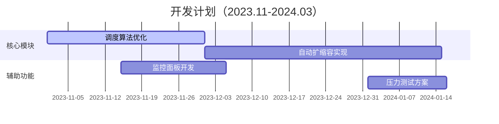

## 前一阶段总结

### 🧩 已完成工作
```dataview
TABLE WITHOUT ID 任务名称, 完成度, 耗时
FROM "毕业设计/进展"
WHERE 状态 = "完成"
```

### ⚙️ 技术实现细节
- **核心模块版本**：  
  `Node.js v18.6.0` | `OpenFaaS 0.24.2` | `Kubernetes 1.27`
- **关键算法实现**：  
  ```python
  # 任务调度伪代码示例
  def schedule_task(task):
      if task.priority == 'HIGH':
          return hot_node_pool.dispatch()
      else:
          return cold_start_handler(task)
  ```
- **性能基准测试**：  
  
| 场景 | QPS | 延迟 | 资源消耗 |
  |------|-----|------|---------|
  | 突发请求(1000/s) | 982 | 68ms | CPU 82% |
  | 持续负载(500/s) | 500 | 23ms | CPU 45% |

### 🚧 遇到的挑战
> [!bug]- <span style="color:red">🔥 紧急缺陷</span>
> 当QPS超过2000时出现内存溢出...

> [!warning]- 遇到的挑战
> 1. **冷启动问题**  
>    - 现象：函数首次调用延迟高达1.8s  
>    - 复现步骤：停止容器实例后发起新请求  
>    - 尝试方案：预加载机制（效果有限）

## 后一阶段计划

### 🎯 核心任务分解


### 🔍 技术攻关重点
1. **性能优化方向**  
   - [ ] 实现基于LRU的容器预热策略  
   - [ ] 探索eBPF实现请求流量预判  
   - [ ] 测试WebAssembly模块化部署

### 📅 里程碑节点
- `2023-12-15` 完成调度算法对比实验
- `2024-01-30` 系统核心功能联调
- `2024-03-01` 论文初稿完成

## 问题与建议

### ❓ 待解决问题清单
```dataviewjs
dv.taskList(dv.pages('"毕业设计"').file.tasks
  .where(t => !t.completed && t.text.includes("#待解决")))
```

### 💡 技术疑问
| 问题类型 | 详细描述 | 尝试方案 | 当前阻碍 |
|---------|---------|---------|---------|
| 冷启动优化 | 如何平衡预加载资源开销 | 动态预热策略 | 缺乏有效指标评估模型 |  
| 分布式追踪 | 跨函数调用链监控 | OpenTelemetry集成 | 日志关联度不足 |

### 📝 导师建议记录
> **2023-11-05 王教授指导意见**  
> 1. 建议参考AWS Firecracker的微VM方案（文献[1]）  
> 2. 实验数据需包含与Knative的横向对比  
> 3. 论文第三章应补充架构决策树分析

---

###### 附录
[1] 《Serverless Architectures on AWS》第8章容器技术  
[2] Kubernetes Autoscaling官方文档  

